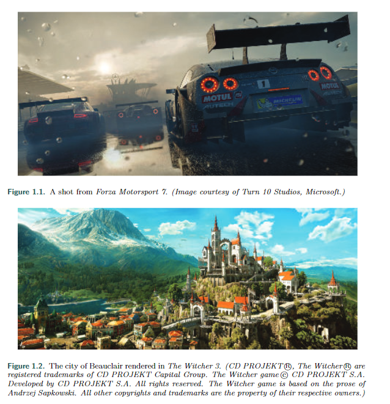
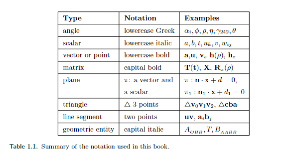

# Chapter 1 Introduction

实时渲染是指在计算机上快速生成图像的过程。它是计算机图形学中最具互动性的领域。图像出现在屏幕上，观众进行行动或反应，这种反馈影响着下一帧的生成。这种反应和渲染的循环以足够快的速度进行，以至于观众看不到单个图像，而是沉浸在一个动态的过程中。

图像显示的速度以每秒帧数（FPS）或赫兹（Hz）来衡量。每秒一帧时，几乎没有互动的感觉；用户痛苦地意识到每个新图像的到来。当帧率达到约6 FPS时，互动感开始增强。视频游戏的目标是30、60、72或更高的帧率；在这些速度下，用户专注于行动和反应。

电影放映机以24帧每秒的速度显示帧，但使用快门系统将每帧显示两到四次，以避免闪烁。这个刷新率与显示速率是分开的，并以赫兹（Hz）表示。一个照亮帧三次的快门具有72 Hz的刷新率。液晶显示器也将刷新率与显示速率分开。

在屏幕上以24帧每秒的速度观看图像可能是可以接受的，但更高的刷新率对于最小化响应时间很重要。只有15毫秒的时间延迟就足以减慢并干扰交互[1849]。以虚拟现实为例，头戴式显示器通常需要90帧每秒以最小化延迟。

实时渲染不仅仅涉及交互性。如果速度是唯一的标准，那么任何快速响应用户命令并在屏幕上绘制任何内容的应用程序都可以符合要求。实时渲染通常意味着生成三维图像。

互动性和对三维空间的某种连接感是实时渲染的充分条件，但第三个元素已经成为其定义的一部分：图形加速硬件。许多人认为1996年3Dfx Voodoo 1卡的推出是消费级三维图形的真正开始[408]。随着这个市场的快速发展，现在每台计算机、平板电脑和手机都内置了图形处理器。硬件加速所实现的实时渲染的一些优秀示例如图1.1和1.2所示。

图形硬件的进步推动了交互式计算机图形领域的研究爆炸。我们将重点提供提高速度和改善图像质量的方法，同时描述加速算法和图形API的特点和限制。我们无法对每个主题进行深入讨论，因此我们的目标是呈现关键概念和术语，解释该领域中最强大和实用的算法，并提供更多信息的最佳去处。我们希望我们努力为您提供理解这个领域的工具能够值得您花费时间和精力阅读我们的书。

## 1.1. Contents Overview

接下来是对接下来几章的简要概述。

第二章，图形渲染管线。实时渲染的核心是一系列步骤，将场景描述转换为我们可以看到的内容。

第三章，图形处理单元。现代GPU使用固定功能和可编程单元实现渲染管线的各个阶段。

第四章，变换。变换是操纵物体的位置、方向、大小和形状以及相机的位置和视图的基本工具。

第五章，着色基础。讨论了材料和光源的定义及其在实现所需的表面外观（无论是逼真还是风格化）方面的应用。还介绍了其他与外观相关的主题，如通过使用抗锯齿、透明度和伽马校正提供更高的图像质量。

第六章，纹理。实时渲染中最强大的工具之一是能够快速访问和显示图像在表面上。这个过程被称为纹理，有各种各样的应用方法。

第七章，阴影。在场景中添加阴影可以增加逼真度和理解力。介绍了计算阴影的更流行的算法。

第八章，光与颜色。在进行基于物理的渲染之前，我们首先需要了解如何量化光和颜色。在完成物理渲染过程后，我们需要将结果转换为显示的值，考虑到屏幕和观看环境的属性。这两个主题都在本章中涵盖。

第九章，基于物理的着色。我们从基础开始理解基于物理的着色模型。本章从基本的物理现象开始，涵盖了各种渲染材料的模型，并介绍了将材料混合在一起并进行滤波以避免混淆和保持表面外观的方法。

第十章，本地照明。探索了描绘更复杂光源的算法。表面着色考虑到光是由具有特定形状的物体发射的。

第11章，全局照明。模拟光与场景之间的多次相互作用的算法进一步增加了图像的逼真度。我们讨论环境和定向遮挡以及在漫反射和镜面表面上渲染全局照明效果的方法，以及一些有前景的统一方法。

第12章，图像空间效果。图形硬件擅长以快速速度进行图像处理。首先讨论图像滤波和重新投影技术，然后调查几种流行的后期处理效果：镜头光晕、动态模糊和景深。

第13章，超越多边形。三角形并不总是描述物体最快、最真实的方式。基于使用图像、点云、体素和其他样本集的替代表示方法各有优势。

第14章，体积和半透明渲染。重点是体积材料表示及其与光源的相互作用的理论和实践。模拟的现象范围从大规模的大气效应到薄发丝内的光散射。

第15章，非真实感渲染。试图使场景看起来逼真只是渲染的一种方式。还有其他风格，如卡通着色和水彩效果。还讨论了线条和文本生成技术。

第16章，多边形技术。几何数据来自各种来源，有时需要修改以实现快速和良好的渲染。介绍了多边形数据表示和压缩的许多方面。

第17章，曲线和曲面。更复杂的曲面表示具有优势，如能够在质量和渲染速度之间进行权衡、更紧凑的表示和平滑的曲面生成。

第18章，管道优化。一旦应用程序运行并使用高效算法，可以使用各种优化技术使其运行更快。找到瓶颈并决定如何处理是这里的主题。还讨论了多处理。

第19章，加速算法。在使其运行后，使其运行更快。涵盖了各种剔除和细节级别渲染的形式。

第20章，高效着色。场景中大量的光源会严重降低性能。在确定可见之前完全着色表面片段是浪费周期的另一个来源。我们探索了各种方法来解决这些和其他形式的低效性问题。

第21章，虚拟现实和增强现实。这些领域在以快速和一致的速度高效生成逼真图像方面面临特殊挑战和技术。

第22章，相交测试方法。相交测试对于渲染、用户交互和碰撞检测非常重要。这里提供了广泛的最高效的常见几何相交测试算法的深入介绍。

第23章，图形硬件。这里的重点是颜色深度、帧缓冲区和基本架构类型等组件。还提供了代表性GPU的案例研究。

第24章，未来。猜一下吧（我们也在猜测）。

## 1.2. Notation and Definitions

### 1.2.1 Mathematical Notation

表1总结了我们将使用的大部分数学符号。其中一些概念将在此处进行详细描述。请注意，表中的规则有一些例外，主要是使用文献中已经非常成熟的符号来表示阴影方程，例如，用L表示辐射度，用E表示辐照度，用$\sigma_s$表示散射系数。角度和标量取自R，即它们是实数。向量和点用粗体小写字母表示，组成部分可以通过$$v = \begin{Bmatrix}    v_x \\    v_y \\    v_z \\ \end{Bmatrix}$$访问，即以列向量格式表示，这在计算机图形学界中常用。在文本中的某些地方，我们使用$(v_x, v_y, v_z)$而不是形式上更正确的$(v_x v_y v_z)^T$，因为前者更容易阅读。

