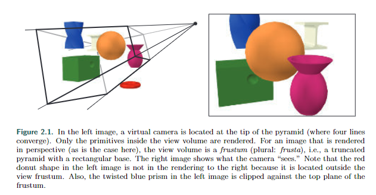
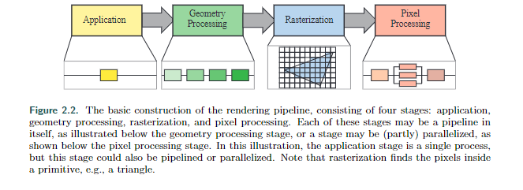
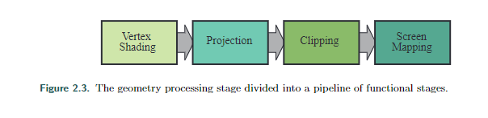
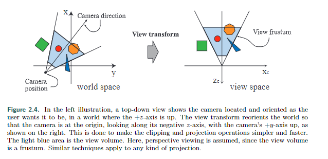
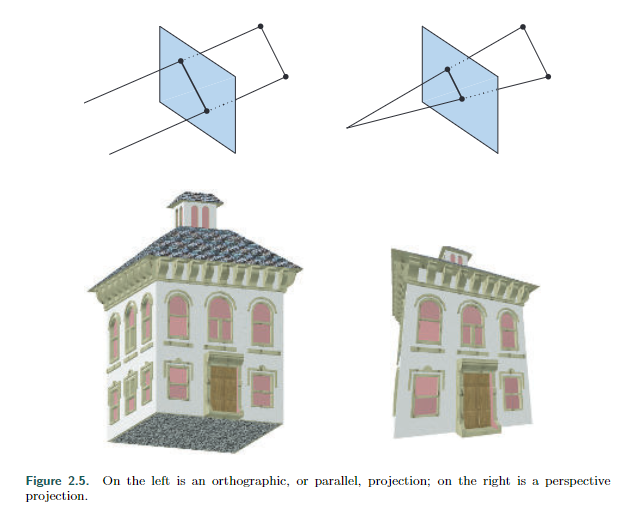
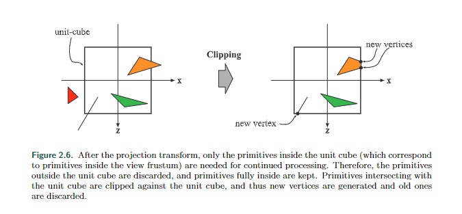
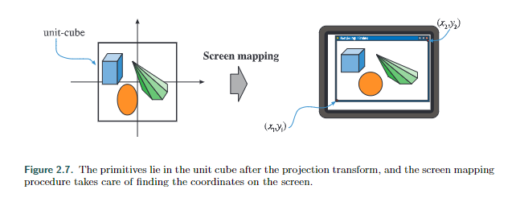
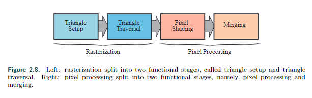
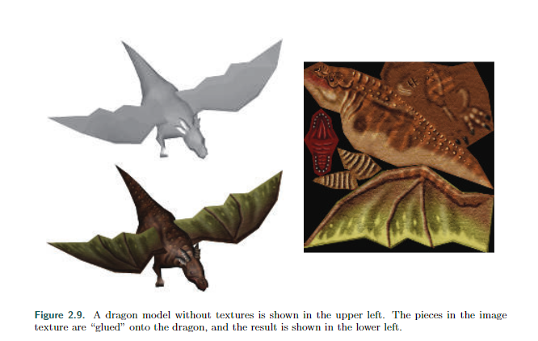

# Chapter 2 The Graphics Rendering Pipeline

本章介绍了实时图形的核心组件，即图形渲染管线，也简称为“管线”。管线的主要功能是在给定虚拟摄像机、三维物体、光源等条件下生成或渲染二维图像。因此，渲染管线是实时渲染的基础工具。使用管线的过程如图2.1所示。图像中物体的位置和形状由它们的几何形状、环境特性以及摄像机在该环境中的位置决定。物体的外观受到材质属性、光源、纹理（应用于表面的图像）和着色方程的影响。

我们将解释渲染管线的不同阶段，重点是功能而不是实现。应用这些阶段的相关细节将在后面的章节中进行介绍。

## 2.1 Architecture

在物理世界中，流水线的概念以许多不同的形式呈现，从工厂的装配线到快餐厨房。它也适用于图形渲染。流水线由几个阶段组成[715]，每个阶段执行更大任务的一部分。

流水线阶段并行执行，每个阶段依赖于前一个阶段的结果。理想情况下，将非流水线系统分为n个流水线阶段可以提高n倍的速度。这种性能提升是使用流水线的主要原因。例如，一系列人可以快速准备大量三明治——一个人准备面包，另一个加肉，另一个加配料。每个人将结果传递给下一个人，并立即开始下一个三明治的工作。如果每个人需要二十秒来完成任务，最大速率为每二十秒一个三明治，每分钟三个。流水线阶段并行执行，但它们会被最慢的阶段阻塞，直到它完成任务。例如，假设加肉阶段变得更复杂，需要三十秒。现在可以实现的最佳速率是每分钟两个三明治。对于这个特定的流水线，加肉阶段是瓶颈，因为它决定了整个生产的速度。在等待加肉阶段完成的时间内，配料阶段被称为饥饿（顾客也是如此）。

这种管道构造也可以在实时计算机图形的背景下找到。将实时渲染管道粗略地分为四个主要阶段——应用程序、几何处理、光栅化和像素处理——如图2.2所示。这个结构是渲染管道的核心——引擎，它被用于实时计算机图形应用程序，并且因此是后续章节讨论的基础。每个阶段通常都是一个独立的管道，这意味着它由几个子阶段组成。我们区分这里显示的功能阶段和它们的实现结构。功能阶段有一定的任务要执行，但不指定任务在管道中的执行方式。给定的实现可以将两个功能阶段合并为一个单元，或者使用可编程核心执行，同时将另一个耗时更长的功能阶段分成几个硬件单元。

渲染速度可以用每秒帧数（FPS）来表示，即每秒渲染的图像数量。它也可以用赫兹（Hz）来表示，赫兹简单地表示每秒的更新频率。通常也可以用毫秒（ms）来表示渲染一幅图像所需的时间。生成一幅图像的时间通常会有所变化，取决于每帧计算过程的复杂性。帧数用于表示特定帧的速率，或者在一段使用时间内的平均性能。赫兹用于硬件，例如显示器，其刷新率是固定的。

应用阶段由应用程序驱动，通常在通用CPU上运行的软件中实现。这些CPU通常包含多个核心，能够并行处理多个执行线程。这使得CPU能够高效地运行应用阶段的各种任务。在CPU上通常执行的一些任务包括碰撞检测、全局加速算法、动画、物理模拟等，具体取决于应用程序的类型。下一个主要阶段是几何处理，处理变换、投影和其他类型的几何操作。该阶段计算要绘制的内容、如何绘制以及在哪里绘制。几何阶段通常在图形处理单元（GPU）上执行，GPU包含许多可编程核心和固定操作硬件。光栅化阶段通常以三个顶点（形成一个三角形）作为输入，找到被认为在三角形内部的所有像素，然后将其传递到下一个阶段。最后，像素处理阶段对每个像素执行一个程序，确定其颜色，并可能执行深度测试以确定其是否可见。它还可以执行像素级操作，例如将新计算的颜色与先前的颜色混合。光栅化和像素处理阶段也完全在GPU上进行处理。这些阶段及其内部流水线将在接下来的四个部分中讨论。有关GPU如何处理这些阶段的更多细节将在第三章中给出。

## 2.2 The Application Stage

开发人员对应用阶段发生的一切都有完全控制权，因为它通常在CPU上执行。因此，开发人员可以完全确定实现，并可以后续修改以提高性能。这里的更改也会影响后续阶段的性能。例如，应用阶段的算法或设置可以减少要渲染的三角形数量。

尽管如此，一些应用工作可以由GPU执行，使用称为计算着色器的单独模式。该模式将GPU视为高度并行的通用处理器，忽略其专门用于渲染图形的特殊功能。

在应用阶段结束时，要渲染的几何图形被传送到几何处理阶段。这些是渲染原语，即点、线和三角形，最终可能出现在屏幕上（或者使用的任何输出设备上）。这是应用阶段最重要的任务。

由于该阶段的软件实现，它没有像几何处理、光栅化和像素处理阶段那样被划分为子阶段。然而，为了提高性能，该阶段通常在多个处理器核心上并行执行。在CPU设计中，这被称为超标量结构，因为它能够同时在同一阶段执行多个进程。第18.5节介绍了使用多个处理器核心的各种方法。

在该阶段常常实现的一个常见过程是碰撞检测。在检测到两个物体之间发生碰撞后，可能会生成响应并发送回碰撞物体，以及发送到力反馈设备。应用阶段还是处理来自其他来源（如键盘、鼠标或头戴显示器）的输入的地方。根据这个输入，可以采取多种不同的操作。加速算法，如特定的剔除算法（第19章），也是在这里实现的，以及其他管道的其余部分无法处理的内容。

## 2.3 Geometry Processing

在GPU上的几何处理阶段负责大部分三角形和顶点操作。该阶段进一步分为以下功能阶段：顶点着色、投影、裁剪和屏幕映射（图2.3）。

### 2.3.1 Vertex Shading

顶点着色的两个主要任务是计算顶点的位置和评估程序员可能希望作为顶点输出数据的内容，例如法线和纹理坐标。传统上，通过将光照应用于每个顶点的位置和法线来计算对象的大部分阴影，并仅在顶点处存储结果颜色。然后在三角形上进行插值。因此，这个可编程的顶点处理单元被命名为顶点着色器[1049]。随着现代GPU的出现，以及一些或全部的着色发生在每个像素上，这个顶点着色阶段更加通用，可能根据程序员的意图根本不评估任何着色方程。顶点着色器现在是一个更通用的单元，专门用于设置与每个顶点相关的数据。例如，顶点着色器可以使用第4.4节和4.5节中的方法来对对象进行动画处理。

我们首先描述如何计算顶点位置，这是始终需要的一组坐标。在传输到屏幕的过程中，模型会转换为几个不同的空间或坐标系统。最初，模型位于自己的模型空间中，这意味着它根本没有被转换。每个模型可以关联一个模型变换，以便可以定位和定向。一个模型可以关联多个模型变换。这允许同一场景中的多个副本（称为实例）具有不同的位置、方向和大小，而无需复制基本几何体。

模型的顶点和法线是由模型变换进行变换的。物体的坐标被称为模型坐标，在模型变换应用到这些坐标之后，模型被称为位于世界坐标或世界空间中。世界空间是唯一的，在各自的模型变换被应用后，所有的模型都存在于这个相同的空间中。

如前所述，只有相机（或观察者）看到的模型才会被渲染。相机在世界空间中有一个位置和一个方向，用于放置和瞄准相机。为了方便投影和裁剪，相机和所有的模型都会通过视图变换进行变换。视图变换的目的是将相机放置在原点，并瞄准它，使其朝向负z轴的方向，y轴指向上方，x轴指向右方。我们使用负z轴约定；有些文本更喜欢沿着+z轴向下看。这两者之间的差异主要是语义上的，因为它们之间的转换很简单。视图变换应用后的实际位置和方向取决于底层应用程序编程接口（API）。因此，所划定的空间被称为相机空间，或更常见的称为视图空间或眼空间。图2.4展示了视图变换如何影响相机和模型的示例。模型变换和视图变换都可以实现为4×4矩阵，这是第4章的主题。

然而，重要的是要认识到顶点的位置和法线可以用程序员喜欢的任何方式计算。

接下来，我们描述顶点着色的第二种类型的输出。要生成逼真的场景，仅渲染对象的形状和位置是不够的，还必须对它们的外观进行建模。该描述包括每个物体的材质，以及照射在物体上的任何光源的效果。材质和灯光可以通过多种方式建模，从简单的颜色到物理描述的复杂表示。这种确定光线对材质的影响的操作称为着色。它涉及计算物体上各个点的着色方程。通常，其中一些计算是在模型顶点的几何处理期间执行的，而其他计算可能在每像素处理期间执行。每个顶点可以存储各种材质数据，例如点的位置、法线、颜色或评估着色方程所需的任何其他数字信息。然后，顶点着色结果（可以是颜色、矢量、纹理坐标以及任何其他类型的着色数据）被发送到光栅化和像素处理阶段进行插值并用于计算表面的着色。

本书中更深入地讨论了 GPU 顶点着色器形式的顶点着色，特别是在第 3 章和第 5 章中。

作为顶点着色的一部分，渲染系统执行投影和剪裁操作，将视图体转换为一个极点为(-1, -1, -1)和(1, 1, 1)的单位立方体。可以使用不同的范围来定义相同的体积，例如0 ≤ z ≤ 1。单位立方体被称为规范视图体积。投影首先完成，在GPU上由顶点着色器完成。有两种常用的投影方法，即正交投影（也称为平行投影）和透视投影。请参见图2.5。事实上，正交投影只是平行投影的一种类型。其他几种投影方法也被广泛应用，尤其在建筑领域，例如倾斜投影和轴测投影。古老的街机游戏Zaxxon就是以后者命名的。

请注意，投影是以矩阵的形式表示（第4.7节），因此有时可以与其他几何变换连接在一起。

正交投影的视图体积通常是一个矩形盒子，正交投影将这个视图体积转换为单位立方体。正交投影的主要特点是平行线在变换后仍然保持平行。这个变换是平移和缩放的组合。

透视投影稍微复杂一些。在这种投影类型中，物体离相机越远，在投影后看起来就越小。此外，平行线可能会在地平线上汇聚。透视变换模拟了我们感知物体大小的方式。从几何上讲，视景体（frustum）是一个带有矩形底面的截锥体。截锥体也被转换为单位立方体。正交投影和透视投影都可以使用 4×4 的矩阵构建（第四章），在进行任意一种变换后，模型被称为剪裁坐标。剪裁坐标实际上是齐次坐标，在第四章进行了讨论，所以这发生在除以 w 之前。为了使下一个功能阶段——剪裁——能够正常工作，GPU 的顶点着色器必须始终输出这种类型的坐标。

尽管这些矩阵将一个体积转换为另一个体积，但它们被称为投影，因为在显示后，z 坐标不会存储在生成的图像中，而是存储在一个称为 z-buffer 的缓冲区中，这在2.5节中有描述。通过这种方式，模型从三维投影到二维。

### 2.3.2 Optional Vertex Processing

每个管线都有刚刚描述的顶点处理。一旦完成了这个处理，就可以在GPU上进行一些可选的阶段，按照顺序分别是细分、几何着色和流输出。它们的使用取决于硬件的能力（并非所有GPU都具备）和程序员的需求。它们彼此独立，并且通常不常用。第三章将对每个阶段进行更详细的介绍。

第一个可选阶段是细分。想象一下，你有一个弹跳的球体对象。如果用一组三角形来表示它，可能会遇到质量或性能方面的问题。你的球在5米远的地方看起来不错，但近距离观察时，尤其是轮廓线上的单个三角形会变得可见。如果你用更多的三角形来制作球体以提高质量，当球体远离并且在屏幕上只覆盖了几个像素时，可能会浪费大量的处理时间和内存。通过细分，可以生成具有适当数量三角形的曲面。

我们已经谈到了三角形，但在管线的这一阶段之前，我们只处理了顶点。这些顶点可以用来表示点、线、三角形或其他对象。顶点可以用来描述一个弯曲的表面，比如一个球体。这样的表面可以由一组补丁来指定，每个补丁由一组顶点组成。细分阶段由一系列阶段组成——外壳着色器、细分器和域着色器，它们将这些补丁顶点转换为（通常）更大的顶点集，然后用于生成新的三角形集。场景的相机可以用来确定生成多少个三角形：当补丁靠近时生成多个，当补丁远离时生成少量。

下一个可选阶段是几何着色器。这个着色器早于细分着色器，因此在GPU上更常见。它类似于细分着色器，可以接收各种基元并生成新的顶点。它是一个简化的阶段，因为其创建范围有限，输出基元的类型也更有限。几何着色器有多种用途，其中最流行的之一是粒子生成。想象一下模拟烟花爆炸。

最后一个可选阶段被称为流输出。这个阶段允许我们将GPU用作几何引擎。在将我们处理过的顶点发送到屏幕渲染的其余部分之前，我们可以选择将这些顶点输出到一个数组中以进行进一步处理。这些数据可以由CPU或GPU本身在后续的处理中使用。这个阶段通常用于粒子模拟，比如我们的烟花示例。

这三个阶段按照顺序执行——细分、几何着色和流输出——每个阶段都是可选的。无论使用哪些（如果有的话）选项，如果我们继续沿着管道前进，我们将得到一组具有齐次坐标的顶点，这些顶点将被检查以确定相机是否查看它们。

### 2.3.3 Clipping

只有完全或部分位于视图体积内的基元需要传递到光栅化阶段（以及随后的像素处理阶段），然后在屏幕上绘制它们。完全位于视图体积内的基元将按原样传递到下一个阶段。**完全位于视图体积外**的基元不会进一步传递，因为它们不会被渲染。部分位于视图体积内的基元需要进行裁剪。例如，一条线段有一个顶点在视图体积外，一个顶点在视图体积内，应该对其进行裁剪，使在视图体积外的顶点被位于线段和视图体积交点处的新顶点所替代。使用投影矩阵的好处是，变换后的基元被裁剪到单位立方体。在裁剪之前执行视图变换和投影的优点是使裁剪问题保持一致；基元始终被裁剪到单位立方体。

裁剪过程如图2.6所示。除了视图体积的六个裁剪平面外，用户还可以定义额外的裁剪平面来可视化切割对象。图19.1（第818页）显示了这种类型的可视化，称为剖面图。

裁剪步骤使用投影生成的四维齐次坐标进行裁剪。在透视空间中，数值通常不会在三角形中线性插值。第四个坐标是为了在使用透视投影时正确插值和裁剪数据。最后，进行透视除法，将结果三角形的位置转换为三维归一化设备坐标。如前所述，此视图体积范围从（-1，-1，-1）到（1，1，1）。几何阶段的最后一步是从此空间转换为窗口坐标。

### 2.3.4 Screen Mapping

只有视图体积内的（剪裁的）基元才会传递到屏幕映射阶段，并且在进入该阶段时，坐标仍然是三维的。每个基元的x和y坐标被转换为屏幕坐标。屏幕坐标和z坐标一起被称为窗口坐标。假设场景应该渲染到一个最小角落为（x1，y1）和最大角落为（x2，y2）的窗口中，其中x1 < x2且y1 < y2。然后，屏幕映射是一个平移操作后跟一个缩放操作。新的x和y坐标被称为屏幕坐标。z坐标（对于OpenGL为[-1，+1]，对于DirectX为[0，1]）也被映射到[z1，z2]，其中z1 = 0和z2 = 1是默认值。但是，这些值可以通过API进行更改。窗口坐标以及重新映射的z值一起传递到光栅化阶段。屏幕映射过程如图2.7所示。

接下来，我们将描述整数和浮点值与像素（和纹理坐标）的关系。给定一个水平像素数组，并使用笛卡尔坐标，最左边的像素的左边缘在浮点坐标中为0.0。OpenGL一直使用这种方案，DirectX 10及其后续版本也使用它。该像素的中心位于0.5。因此，像素范围[0, 9]覆盖了从[0.0, 10.0)的跨度。转换简单地是

$$d = floor(c)（2.1）$$，

$$c = d + 0.5（2.2）$$，

其中d是像素的离散（整数）索引，c是像素内的连续（浮点）值。虽然所有API的像素位置值从左到右增加，但OpenGL和DirectX之间在某些情况下对于顶部和底部边缘的零点位置不一致。OpenGL始终支持笛卡尔系统，将左下角视为最低值元素，而DirectX有时将左上角定义为该元素，具体取决于上下文。每种情况都有其逻辑，它们的差异没有正确答案。例如，在OpenGL中，(0, 0)位于图像的左下角，而在DirectX中，它位于图像的左上角。当从一个API转移到另一个API时，考虑到这种差异是很重要的。

## 2.4 Rasterization

给定经过变换和投影的顶点及其相关的着色数据（都来自几何处理），下一阶段的目标是找到所有位于正在渲染的基元（例如三角形）内部的像素元素，简称像素。我们将这个过程称为光栅化，它分为两个功能子阶段：三角形设置（也称为基元组装）和三角形遍历。这些在图2.8左侧显示。请注意，这些也可以处理点和线，但由于三角形最常见，子阶段的名称中都带有“三角形”。光栅化，也称为扫描转换，因此是将屏幕空间中的二维顶点（每个顶点都有一个z值（深度值）和与每个顶点相关的各种着色信息）转换为屏幕上的像素。光栅化也可以被视为几何处理和像素处理之间的同步点，因为在这里三角形由三个顶点形成，并最终发送到像素处理。

三角形是否被认为与像素重叠取决于您如何设置GPU的管道。例如，您可以使用点采样来确定“内部”。最简单的情况是在每个像素的中心使用单个点采样，因此如果该中心点位于三角形内部，则相应的像素也被认为位于三角形内部。您还可以使用超采样或多采样抗锯齿技术在每个像素上使用多个采样点（第5.4.2节）。另一种方法是使用保守光栅化，其中定义是如果像素的至少一部分与三角形重叠，则该像素被认为是“内部”（第23.1.2节）。

### 2.4.1 Triangle Setup

在这个阶段，计算三角形的差分、边缘方程和其他数据。这些数据可以用于三角形遍历（第2.4.2节），以及用于插值几何阶段产生的各种着色数据。固定功能硬件用于此任务。

### 2.4.2 Triangle Traversal

这里是对每个像素进行检查的地方，只要其中心（或样本）被三角形覆盖，就会为与三角形重叠的像素部分生成一个片段。更复杂的采样方法可以在第5.4节中找到。确定哪些样本或像素位于三角形内部通常被称为三角形遍历。每个三角形片段的属性是使用三个三角形顶点之间插值的数据生成的（第5章）。这些属性包括片段的深度，以及来自几何阶段的任何着色数据。McCormack等人[1162]提供了有关三角形遍历的更多信息。这也是进行透视校正插值的地方[694]（第23.1.1节）。然后，所有位于基元内部的像素或样本都被发送到下一个像素处理阶段。

## 2.5 Pixel Processing

在这一点上，由于所有先前阶段的组合，被认为在三角形或其他基元内的所有像素都已被找到。像素处理阶段分为像素着色和合并，如图2.8右侧所示。像素处理是在基元内的像素或样本上执行每像素或每样本计算和操作的阶段。

### 2.5.1 Pixel Shading

在这里执行任何逐像素的着色计算，使用插值的着色数据作为输入。最终的结果是一个或多个颜色传递给下一个阶段。与通常由专用硬件电路执行的三角形设置和遍历阶段不同，像素着色阶段由可编程的GPU核心执行。为此，程序员提供了一个像素着色器的程序（或在OpenGL中称为片段着色器），它可以包含任何所需的计算。这里可以使用各种各样的技术，其中最重要的之一是纹理。纹理在第6章中有更详细的介绍。简单来说，给对象贴上一个或多个图像，以实现各种目的，就是纹理。这个过程的一个简单例子如图2.9所示。图像可以是一维、二维或三维的，其中二维图像最常见。最简单的情况下，最终的产品是每个片段的颜色值，并将其传递给下一个子阶段。

### 2.5.2 Merging

每个像素的信息存储在颜色缓冲区中，它是一个颜色的矩形数组（每个颜色有红色、绿色和蓝色分量）。合并阶段的责任是将像素着色阶段产生的片段颜色与当前存储在缓冲区中的颜色进行合并。这个阶段也被称为ROP，根据不同的人，它可以是“光栅操作（流水线）”或“渲染输出单元”。与着色阶段不同，执行这个阶段的GPU子单元通常不是完全可编程的。然而，它具有高度可配置性，可以实现各种效果。

这个阶段还负责解决可见性。这意味着当整个场景被渲染完毕时，颜色缓冲区应该包含从相机视角可见的场景中基元的颜色。对于大多数甚至所有的图形硬件来说，这是通过z缓冲区（也称为深度缓冲区）算法来实现的[238]。z缓冲区与颜色缓冲区具有相同的大小和形状，对于每个像素，它存储了当前最近基元的z值。这意味着当一个基元被渲染到某个像素时，该像素上的基元的z值被计算并与相同像素的z缓冲区的内容进行比较。如果新的z值小于z缓冲区中的z值，则正在渲染的基元比之前最接近相机的基元更接近相机。因此，该像素的z值和颜色将被更新为正在绘制的基元的z值和颜色。如果计算得到的z值大于z缓冲区中的z值，则颜色缓冲区和z缓冲区保持不变。z缓冲区算法简单，具有O(n)的收敛性（其中n是正在渲染的基元数量），适用于任何可以为每个（相关的）像素计算z值的绘制基元。还要注意，该算法允许大多数基元以任何顺序进行渲染，这也是它受欢迎的另一个原因。然而，z缓冲区仅在屏幕上的每个点存储一个深度，因此无法用于部分透明的基元。这些基元必须在所有不透明基元之后以及从后向前的顺序进行渲染，或者使用单独的无序算法（第5.5节）。透明度是基本z缓冲区的主要弱点之一。

我们已经提到过颜色缓冲区用于存储颜色，而z缓冲区则用于存储每个像素的z值。然而，还有其他通道和缓冲区可以用于过滤和捕获片段信息。α通道与颜色缓冲区相关联，为每个像素存储一个相关的不透明度值（第5.5节）。在旧的API中，α通道也被用于通过α测试功能有选择性地丢弃像素。现在可以在像素着色器程序中插入丢弃操作，并可以使用任何类型的计算来触发丢弃。这种类型的测试可以用于确保完全透明的片段不会影响z缓冲区（第6.6节）。
模板缓冲区(stencil buffer)是一个离屏缓冲区，用于记录渲染的基元的位置。它通常每个像素包含8位。可以使用各种函数将基元渲染到模板缓冲区中，然后可以使用缓冲区的内容来控制渲染到颜色缓冲区和z缓冲区中。例如，假设一个填充的圆已经绘制到了模板缓冲区中。可以将其与一个运算符结合使用，只允许后续基元在颜色缓冲区中渲染到圆存在的地方。模板缓冲区可以是生成一些特殊效果的强大工具。管道末端的所有这些功能被称为光栅操作（ROP）或混合操作。可以将当前颜色缓冲区中的颜色与正在处理的三角形内的像素的颜色混合。这可以实现透明度或颜色样本的累积等效果。如前所述，混合通常可以使用API进行配置，而不是完全可编程。然而，一些API支持光栅顺序视图，也称为像素着色器排序，可以实现可编程的混合能力。

**帧缓冲器通常由系统上的所有缓冲区组成。**当图元达到并通过光栅化阶段时，从相机视角可见的图元将显示在屏幕上。屏幕显示颜色缓冲区的内容。为了避免让人眼在图元被光栅化并发送到屏幕时看到它们，使用双缓冲技术。这意味着场景的渲染发生在屏幕外的后缓冲区中。一旦场景在后缓冲区中渲染完成，后缓冲区的内容将与之前显示在屏幕上的前缓冲区的内容进行交换。交换通常发生在垂直回扫期间，这是一个安全的时机。有关不同缓冲区和缓冲方法的更多信息，请参见第5.4.2节、第23.6节和第23.7节。

## 2.6 Through the Pipeline

点、线和三角形是构建模型或对象的渲染基元。想象一下，应用程序是一个交互式计算机辅助设计（CAD）应用程序，用户正在检查一个华夫饼机的设计。在这里，我们将跟随这个模型通过整个图形渲染流水线，包括四个主要阶段：应用程序、几何、光栅化和像素处理。场景以透视方式渲染到屏幕上的窗口中。在这个简单的例子中，华夫饼机模型包括线（用于显示零件的边缘）和三角形（用于显示表面）。华夫饼机有一个可以打开的盖子。一些三角形通过一个带有制造商标志的二维图像进行纹理处理。对于这个例子，表面着色完全在几何阶段计算，除了纹理的应用，它发生在光栅化阶段。

**应用程序**
CAD应用程序允许用户选择和移动模型的部分。例如，用户可以选择盖子，然后移动鼠标打开它。应用程序阶段必须将鼠标移动转换为相应的旋转矩阵，然后在渲染时正确应用于盖子。另一个例子：播放动画，将摄像机沿着预定义的路径移动，以显示华夫饼机的不同视角。然后，应用程序根据时间更新摄像机参数，如位置和视角。为了渲染每一帧，应用程序阶段将摄像机位置、光照和模型的基本元素传递给管道中的下一个主要阶段-几何阶段。

**几何处理** 
对于透视视图，我们在这里假设应用程序已经提供了投影矩阵。此外，对于每个对象，应用程序已经计算了一个描述视图变换以及对象在自身中的位置和方向的矩阵。在我们的示例中，华夫饼机的底座将有一个矩阵，盖子将有另一个矩阵。在几何阶段，使用这个矩阵转换对象的顶点和法线，将对象放入视图空间中。然后可以计算顶点处的着色或其他计算，使用材料和光源属性。然后使用单独提供的用户投影矩阵执行投影，将对象转换为表示眼睛所看到的单位立方体空间。立方体外的所有基元都被丢弃。与该单位立方体相交的所有基元都被裁剪以获得完全位于单位立方体内的一组基元。然后将顶点映射到屏幕上的窗口中。在执行所有这些三角形和顶点操作之后，结果数据被传递到光栅化阶段。

**光栅化**
在前一阶段经过剪裁后幸存下来的所有基元都会被光栅化，这意味着找到并将位于基元内部的所有像素进一步发送到像素处理阶段。

**像素处理**
这里的目标是计算每个可见图元的每个像素的颜色。那些与任何纹理（图像）相关联的三角形将根据需要应用这些图像进行渲染。通过z缓冲算法解决可见性问题，还可以进行可选的丢弃和模板测试。每个对象依次进行处理，然后将最终图像显示在屏幕上。

**结论**
这个渲染管线是通过几十年的API和图形硬件演进而形成的，针对实时渲染应用。需要注意的是，这不是唯一可能的渲染管线；离线渲染管线经历了不同的演化路径。电影制作的渲染通常使用微多边形管线[289, 1734]，但最近**光线追踪和路径追踪**已经取而代之。这些技术在第11.2.2节中介绍，也可以用于建筑和设计预览。

多年来，应用程序开发人员使用的唯一方法是通过正在使用的图形API定义的固定功能管线来使用这里描述的过程。固定功能管线之所以被称为固定功能管线，是因为实现它的图形硬件由无法以灵活方式编程的元素组成。最后一个主要的固定功能机器的例子是任天堂的Wii，于2006年推出。另一方面，可编程GPU使得可以确定在管线的各个子阶段中应用了哪些操作。对于本书的第四版，我们假设所有的开发都是使用可编程GPU进行的。