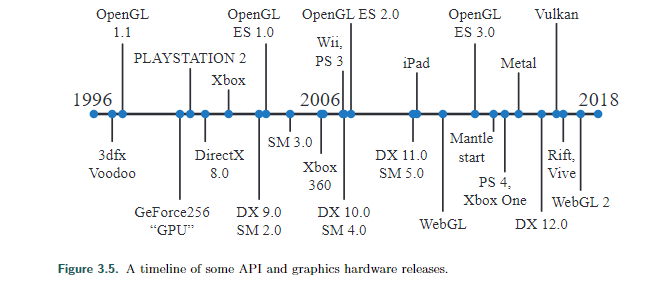
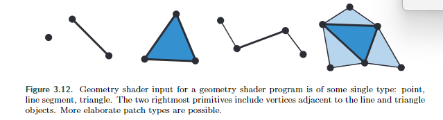

# Chapter 3 The Graphics Processing Unit

在GPU的历史发展上，图形加速首先在与三角形重叠的每个像素扫描线上插值颜色，然后显示这些值。

然后发展出访问图像数据的能力，这些图像作为纹理应用在图形的表面上。GPU最后显示图像需要z-深度检查。这些过程都需要专门的硬件来支持，提高处理速度。后来又更多的功能被加入到GPU中，速度是GPU的核心优势。

1999年发布了第一款消费级图形芯片（NVIDIA的GeForce256），支持硬件顶点处理。英伟达创造了GPU的这个实体概念。后续GPU朝着高度可控可编程的方向发展，开发人员利用各种可编程的着色器实现自己的算法。

GPU的速度关键在于将图形处理中的任务（z-buffer，纹理，像素填充等等）做到了并行化的处理。

GPU由多个着色器核心组成，每个着色器可看作一个小型的处理器，执行一些相对独立的任务，例如将顶点从世界坐标转换为屏幕坐标，或计算由三角形覆盖的像素的颜色。每帧发送到屏幕的三角形数量可能达到数千或数百万个，因此每秒可能会有数十亿次着色器调用，即运行着色器程序的单独实例。

最后是GPU中数据访问，数据访问会有延迟。

## 3.1 Data-Parallel Architectures

CPU通常是由多个处理器，以串行的方式运行各种代码，对于一些向量，由SIMD（单指令多数据）。在CPU中减少数据访问的延迟，通常会配置快速本地缓存（cache，存储下一步可能需要的数据）。另外还有一些设计避免停顿，如分支预测、指令重排序、寄存器重命名和缓存预取，可以看这本[论文](https://dl.acm.org/doi/book/10.5555/1999263)，介绍了计算机体系结构的发展。

图形图像中的数据具有太多的相似点了，GPU可以配置大量的硬件核心（上千个着色器核心）来处理这些数据，这样GPU可以大规模的并行处理这些数据，并且在处理数据的前后保持独立。

GPU的重要指标就是吞吐量（处理数据的速度）。这个指标通常与着色器处理器个数有关。GPU的着色器处理器会遇到一种问题情况：在访问本地的寄存器是极快的，几乎不发生停顿。但是遇到了纹理访问这种需求，着色器需要从内存中获取再返回给着色器处理器，这段时间基本上就处于停顿状态。

GPU通过切换 fragment（这里的fragment是一种将整体划分成part的概念）来避免stall。每个fragment会配置一点存储空间当作本地寄存器。当某个fragment遇到了造成停顿的数据区访问需求，则切换fragment，切换这个动作很快。等其他的fragment都完成了，造成停顿的fragment也都完成了（看上去时间缩短了不少），因此着色器处理器可执行到下一个阶段。

这里暗含着一种设计，GPU应将指令逻辑和数据访问分离开来（单指令多数据，SIMD），完成任务的执行。这里面fragment 在现代GPU设计中由着色器调用的称作线程（thread）。这些线程包含一些内存用于着色器输入。多个线程会被划分组成一些组（这些组在NVIDIA称作wrap，AMD称作wavefront）。一个warp/wavefront由一定数量的GPU着色器核心调度执行，数量从8到64不等，使用SIMD处理。每个线程被映射到一个SIMD lane（SIMD lane 指的是multiple data的维度，比如可同时处理的向量的维度）。

下面是一个例子：

在NVIDIA的GPU上，每个warp包含32个线程。如果现在我们有2000个线程待执行，那么会被分成$$\frac{2000}{32}\approx 63$$个wrap。在一个wrap内，其所包含32个线程以lock-step方式执行，当这个wrap遇到向内存索取数据的时候，其实也是表示这个32个线程遇到了这种情况，这个wrap会暂停运行，此时会替换成另一个warp来执行。

---------------

其实不仅仅有纹理加载影响wrap替换，只要是延迟高的操作都会被导致wrap被替换出去。另外线程少会导致wrap少，并行化不高，那么每个线程里的延迟凸显的更为明显了。

## 3.2 GPU Pipeline Overview

下图是GPU的逻辑模型，依据控制程度的不同进行颜色划分。

逻辑模型与实际的物理模型是不同的。

顶点着色器（vertex shader）是一个完全可编程的阶段，用于实现几何处理阶段，它操作基元（点、线或三角形）的顶点。它可以用于执行每个基元的着色操作，销毁基元或创建新的基元。

曲面细分阶段和几何着色器都是可选的，并非所有的GPU都支持它们，尤其是移动设备上。

**Clipping、Triangle setup and Traversal由固定功能硬件实现。**

Screen mapping受窗口和视口设置的影响，内部形成简单的缩放和重新定位。

像素着色器（pixel shader）阶段是完全可编程的。

合并阶段不可编程，但它具有高度可配置性，并可以设置执行各种各样的操作。它实现了“合并”功能阶段，负责修改颜色、z缓冲区、混合、模板和任何其他与输出相关的缓冲区。像素着色器执行与合并阶段一起形成了第2章中介绍的概念像素处理阶段。

## 3.3 The Programmable Shader Stage

现代的着色器程序的编程设计逐渐变得统一，使用相同的指令集架构。顶点、像素、几何和细分相关的着色器使用一种着色器编程语言，如统一使用HLSL进行编程控制。**实现这种模型的处理器在DirectX中被称为通用着色器核心（common shader core），具有这种核心的GPU可以说他们有统一着色器架构。**

着色器的编程使用各家自己设计的语言进行编程，如DirectX的高级着色语言（HLSL）和OpenGL着色语言（GLSL）。这些语言支持各种数据类型，32位整数和64位浮点数，32位单精度浮点标量和向量。

**浮点向量通常是诸如位置（xyzw）、法线、矩阵行、颜色（rgba）或纹理坐标（uvwq）等数据**。**整数通常用于表示计数器、索引或位掩码。还支持结构、数组和矩阵等聚合数据类型。**

`draw`调用图形API来绘制一组基元，让图形管线执行并运行其着色器。每个可编程着色器阶段都有两种类型的输入：统一输入(uniform input)，其值在绘制调用期间保持不变（但可以在绘制调用之间更改），以及变化输入(varying input)，数据来自三角形的顶点或光栅化。例如，像素着色器可以将光源的颜色作为统一值提供，而三角形表面的位置每个像素都会变化，因此是变化的。纹理是一种特殊类型的统一输入，曾经总是应用于表面的彩色图像，但现在可以被视为任何大型数据数组。

底层虚拟机为不同类型的输入和输出提供了特殊寄存器。

Constant Registers用于存储uniform input，Varying input Registers用于存储varying input。Constant Registers数量4096个比Varying input Registers的16个多得多。

虚拟机还具有通用临时寄存器，用于临时存储空间。所有类型的寄存器都可以使用临时寄存器中的整数值进行数组索引。下图是着色器虚拟机的输入和输出。

流程控制指的是使用分支指令来改变代码执行的流程。与流程控制相关的指令用于实现高级语言结构，如“if”和“case”语句，以及各种类型的循环。着色器支持两种类型的流程控制。**静态流程控制分支基于统一输入的值。这意味着代码的流程在绘制调用期间是恒定的。静态流程控制的主要好处是允许在各种不同情况下使用相同的着色器（例如，不同数量的光源）。由于所有调用都采用相同的代码路径，因此没有线程分歧。**

**动态流控制基于不同输入的值，这意味着每个片段可以以不同的方式执行代码。这比静态流控制更强大，但可能会影响性能，特别是当代码流在着色器调用之间发生不规律的变化时。**

## 3.4 The Evolution of Programmable Shading and APIs

可编程着色框架的概念可以追溯到1984年的Cook的着色树[287]。图3.4显示了一个简单的着色器及其对应的着色树。RenderMan着色语言[63, 1804]是在1980年代末从这个想法中发展起来的。它仍然被用于电影制作渲染，同时还有其他不断发展的规范，如开放着色语言（OSL）项目[608]。

消费级图形硬件最早是由3dfx Interactive于1996年10月1日成功引入的。请参见图3.5，这是从那一年开始的时间线。他们的Voodoo图形卡能够以高质量和性能渲染游戏Quake，因此迅速被采用。这种硬件在整个过程中实现了固定功能的管线。在GPU原生支持可编程着色器之前，有几次尝试通过多次渲染通道实时实现可编程着色操作。在1999年，Quake III: Arena脚本语言成为该领域的首个广泛商业成功案例。正如本章开头所提到的，NVIDIA的GeForce256是第一个被称为GPU的硬件，但它并不可编程。然而，它是可配置的。

在2001年初，NVIDIA的GeForce 3是第一款支持可编程顶点着色器的GPU，通过DirectX 8.0和OpenGL的扩展来实现。这些着色器是用类似汇编语言的语言编写的，由驱动程序在运行时转换为微码。像素着色器也包含在DirectX 8.0中，但是像素着色器在实际可编程性方面存在不足-支持的有限的“程序”被驱动程序转换为纹理混合状态，然后将硬件“寄存器组合器”连接在一起。这些“程序”不仅长度有限（12条指令或更少），而且缺乏重要的功能。Peercy等人通过对RenderMan的研究，确定了依赖纹理读取和浮点数据对于真正的可编程性至关重要。

当时的着色器不允许流程控制（分支），因此条件必须通过计算两个术语并选择或插值结果来模拟。DirectX定义了着色器模型（SM）的概念，以区分具有不同着色器功能的硬件。2002年发布了DirectX 9.0，其中包括Shader Model 2.0，该模型具有真正可编程的顶点和像素着色器。类似的功能也通过OpenGL的各种扩展暴露出来。增加了对任意依赖纹理读取和存储16位浮点值的支持，最终完成了Peercy等人确定的要求集。着色器资源（指令、纹理和寄存器）的限制增加，因此着色器能够实现更复杂的效果。还增加了对流程控制的支持。着色器的长度和复杂性不断增长，使汇编编程模型变得越来越繁琐。幸运的是，**DirectX 9.0还包括了HLSL。这种着色语言是由微软与NVIDIA合作开发的。**大约在同一时间，OpenGL ARB（架构审查委员会）发布了GLSL，这是一种相对类似的用于OpenGL的语言。这些语言在语法和设计理念上受到了C编程语言的很大影响，并包含了来自RenderMan着色语言的元素。

Shader Model 3.0于2004年推出，增加了动态流控制，使着色器变得更加强大。它还将可选功能变为必需功能，进一步增加了资源限制，并在顶点着色器中添加了有限的纹理读取支持。当新一代游戏主机在2005年底（微软的Xbox 360）和2006年底（索尼计算机娱乐的PLAYSTATION 3系统）推出时，它们配备了Shader Model 3.0级别的GPU。任天堂的Wii游戏机是最后一个显著的固定功能GPU，最初于2006年底发售。纯粹的固定功能管线在这一点上已经消失了。着色器语言已经发展到了一个使用各种工具来创建和管理的阶段。图3.6显示了使用Cook的着色树概念的其中一种工具的屏幕截图。

下一个大的可编程性进展也在2006年末出现。Shader Model 4.0是DirectX 10.0中的一部分，引入了几个重要的特性，如几何着色器和流输出。**Shader Model 4.0为所有着色器（顶点、像素和几何）提供了统一的编程模型，即之前所描述的统一着色器设计。**资源限制进一步增加，并添加了对整数数据类型（包括位操作）的支持。OpenGL 3.3中引入的GLSL 3.30提供了类似的着色器模型。

在2009年，**DirectX 11和Shader Model 5.0发布，添加了细分阶段着色器和计算着色器**，也称为DirectCompute。该版本还着重于更有效地支持CPU多处理，这是在第18.5节中讨论的一个主题。OpenGL在4.0版本中添加了细分功能，在4.3版本中添加了计算着色器。DirectX和OpenGL的发展方式不同。两者都为特定版本发布设置了一定级别的硬件支持。微软控制着DirectX API，因此直接与独立硬件供应商（IHVs）如AMD、NVIDIA和英特尔以及游戏开发者和计算机辅助设计软件公司合作，确定要公开的功能。OpenGL由硬件和软件供应商的联合组织Khronos Group开发和管理。由于涉及的公司数量较多，API功能通常会在DirectX中引入后的一段时间内出现在OpenGL的发布版本中。然而，OpenGL允许使用扩展，包括供应商特定或更通用的扩展，以在正式支持之前使用最新的GPU功能。

API的下一个重大变化是由AMD在2013年引入的Mantle API引领的。Mantle是与视频游戏开发商DICE合作开发的，其想法是剥离出大部分图形驱动程序的开销，并将此控制直接交给开发人员。除此重构之外，还进一步支持了有效的CPU多处理。**这一新类API的重点是大大减少CPU在驱动程序中的时间**，并提供更高效的CPU多处理器支持（第18章）。Mantle开创的理念被微软采纳，并于**2015年发布为DirectX 12**。请注意，DirectX 12并不专注于暴露新的GPU功能——DirectX 11.3暴露了相同的硬件特性。这两个API都可以用于将图形发送到虚拟现实系统，如Oculus Rift和HTC Vive。然而，DirectX 12是API的彻底重新设计，更好地映射到现代GPU架构。低开销驱动程序对于CPU驱动程序成本导致瓶颈的应用程序或使用更多CPU处理器进行图形处理可能会提高性能很有用[946]。从早期的API移植可能会很困难，而且天真的实现可能会导致性能下降[249, 699, 1438]。

苹果在2014年发布了自己的低开销 API，称为Metal。最初，Metal在诸如iPhone 5S和iPad Air等移动设备上首次可用，一年后通过OS X El Capitan也向较新的Macintosh提供了支持。除了提高效率外，减少CPU使用还可以节省电力，在移动设备上这一点非常重要。这个API有自己的着色语言，旨在用于图形和GPU计算程序。

AMD将其Mantle工作捐赠给了Khronos Group，后者在2016年初发布了自己的新API，称为Vulkan。与OpenGL类似，Vulkan可以在多个操作系统上运行。Vulkan使用一种名为SPIR-V的新的高级中间语言，用于着色器表示和通用GPU计算。预编译的着色器具有可移植性，因此可以在任何支持所需功能的GPU上使用[885]。Vulkan还可用于非图形GPU计算，因为它不需要显示窗口[946]。Vulkan与其他低开销驱动程序的一个显著差异是，它旨在与各种系统配合使用，从工作站到移动设备。

在移动设备上，使用OpenGL ES是常见的做法。“ES”代表嵌入式系统，因为这个API是为移动设备而开发的。当时的标准OpenGL在某些调用结构上相对庞大且缓慢，并且需要支持很少使用的功能。OpenGL ES 1.0于2003年发布，是OpenGL 1.3的简化版本，描述了一个固定功能管线。与支持DirectX的图形硬件时间同步不同，为移动设备开发图形支持并没有按照相同的方式进行。例如，2010年发布的第一代iPad实现了OpenGL ES 1.1。在2007年，OpenGL ES 2.0规范发布，引入了可编程着色功能。它基于OpenGL 2.0，但没有固定功能组件，因此与OpenGL ES 1.1不兼容。OpenGL ES 3.0于2012年发布，提供了多个渲染目标、纹理压缩、变换反馈、实例化以及更广泛的纹理格式和模式，以及着色器语言的改进。OpenGL ES 3.1添加了计算着色器，3.2添加了几何和细分着色器，还有其他功能。第23章将更详细地讨论移动设备架构。

OpenGL ES的一个分支是通过JavaScript调用的基于浏览器的API WebGL。该API的第一个版本于2011年发布，可在大多数移动设备上使用，因为它在功能上等同于OpenGL ES 2.0。与OpenGL类似，扩展提供了对更高级GPU功能的访问。WebGL 2则需要支持OpenGL ES 3.0。WebGL非常适合在实验或课堂中使用以下特点：
- 它跨平台，在所有个人电脑和几乎所有移动设备上都可以运行。
- 浏览器处理驱动程序的批准。即使一个浏览器不支持特定的GPU或扩展，通常另一个浏览器会支持。
- 代码是解释执行的，无需编译，只需要一个文本编辑器进行开发。
- 大多数浏览器都内置了调试器，可以检查任何网站上运行的代码。
- 程序可以通过上传到网站或Github等平台进行部署。

更高级的场景图和特效库，如three.js [218]，可以轻松访问各种复杂特效的代码，例如阴影算法、后期处理特效、基于物理的着色和延迟渲染。

## 3.5 The Vertex Shader

vertex shader是GPU的逻辑管线中的第一个阶段。在此之前还有一个数据操作阶段，在DirectX中称为输入装配器(Input assembler，IA)。IA阶段是将输入的数据组织起来，形成顶点和图元的集合然后再送入到管线中。比如有一个对象他的数据为一个位置数组，颜色数组。IA会根据这个数据来创建顶点。

 三角网格（triangle mesh）使用一组顶点来表示。每个顶点包含着其在模型表面的位置信息，颜色信息，纹理坐标，表面法线等等。**在渲染时，三角网格通常用于表示底层曲面，并且顶点法线用于表示该曲面的方向**，而不是三角网格本身的方向。下图显示了显示了表示曲面的两个三角网格的侧视图，一个是平滑的，一个有明显的折痕。

之后就是顶点着色器开始处理三角网格。顶点着色器处理每个三角形顶点数据（位置，颜色，法线，纹理坐标等等），但顶点着色器并不处理顶点之间的关系。最后顶点着色器输出一些值，这些顶点只能被独立修改，不会被销毁或者添加。

接下来的章节将解释几种顶点着色器效果，例如用于动画关节的顶点混合和轮廓渲染。顶点着色器的其他用途包括

- 通过仅创建一次网格并通过顶点着色器进行变形来生成对象。 
- 使用蒙皮和变形技术来使角色的身体和面部动画化。 
- 通过使用顶点纹理获取[40, 1227]来应用地形高度场。
- 程序变形，例如旗帜、布料或水的移动[802, 943]。
- 粒子创建，通过将退化（无区域）网格发送到管道中并根据需要为其指定区域。
- 通过使用整个帧缓冲区的内容作为经历程序变形的屏幕对齐网格上的纹理，产生镜头扭曲、热雾、水波纹、卷页和其他效果。
- 通过使用顶点纹理获取来应用地形高度字段 [40, 1227]

下图是顶点着色器处理顶点得到的一些效果图。

## 3.6 TheTessellation Stage

曲面细分阶段（Tessellation Stage）帮助我们渲染曲面。GPU的任务是将每个曲面描述转换为一组组近似代表曲面的的三角形。这个阶段是一个可选的GPU功能，最早在DirectX 11中可用（并且是必需的）。它也在OpenGL 4.0和OpenGL ES 3.2中得到支持。

曲面的描述比描述曲面的三角形精确，但是不好再物理设备上表现。通过为给定的曲面视图生成适当的三角行，来高效的渲染曲面。据一个例子，当人的视图不需要那么精确的时候，也许几个三角形就能表现原曲面的效果。但是当人需要看的十分清楚，那么就需要把原曲面不断微分成很多个三角形来渲染。

曲面细分阶段由三个着色器，分别是**hull shader（壳着色器）、tessellator（细分器）和domain shader（域着色器）**。在OpenGL中，hull shader被称为tessellation control shader（细分控制着色器），而domain shader被称为tessellation evaluation shader（细分评估着色器），这些术语更加描述性，尽管有些冗长。在OpenGL中，固定功能的tessellator被称为primitive generator（原始生成器），正如将会看到的，它确实是这样做的。

下面简要介绍这三个着色器做法以及效果。

Hull shader：输入到Hull shader的是一个patch primitive。一个patch有多个用来细分曲面控制点，贝塞尔曲线补丁，或者其他类型的曲面元素。Hull shader利用传入的pacth对控制点修改，添加，减少控制点，生成一定数量三角形，之后将包含曲面细分控制数据的控制点数据输出到domain shader。

下面是曲面细分阶段的示意图。

Tessellator在管线中功能固定，与细分着色器一起使用。hull shader向tessellator发送关于如何细分曲面的信息（曲面细分因子，type）。曲面细分因子分外部和内部，内部确定三角形的内部的细分程度，外部因子确定边缘的细分程度。Tesselllator会生成多个新顶点，然后在传给domain shader。

下面是曲面细分因子变化的例子

一个简单的曲面细分流程：

1. hull shader传递应用程序计算和提供的所有补丁的固定值集合。
2. Tessellator生成顶点，给它们指定位置，并指定它们形成的三角形或线条。
3. domain shader获取每个点生成的重心坐标，并在补丁的评估方程中使用这些坐标来生成位置、法线、纹理坐标和其他所需的顶点信息。

示例如下：

## 3.7 The Geometry Shader

**几何着色器可以将基元转换为其他基元，而细分阶段无法做到这一点**。例如，通过使每个三角形创建线边，可以将三角形网格转换为线框视图。或者，可以用面向观察者的四边形替换线条，从而制作具有较粗边缘的线框渲染。几何着色器是在2006年底发布的DirectX 10中添加到硬件加速图形管道中的。**它位于管道中的细分着色器之后，并且使用是可选的。**虽然是Shader Model 4.0的必需部分，但在早期的着色器模型中没有使用。OpenGL 3.2和OpenGL ES 3.2也支持这种类型的着色器。

**几何着色器的输入是一个单独的对象及其关联的顶点。**该对象通常由条带中的三角形、线段或仅仅是一个点组成。几何着色器可以定义和处理扩展的基元。特别地，可以传入三角形外的三个额外顶点，并且可以使用折线上的两个相邻顶点。请参见图3.12。使用DirectX 11和Shader Model 5.0，您可以传入更复杂的补丁，最多可达到32个控制点。也就是说，曲面细分阶段对于补丁生成更高效[175]。

**几何着色器处理该基元并输出零个或多个顶点，这些顶点被视为点、折线或三角形条带。**请注意，几何着色器可能不会生成任何输出。通过这种方式，可以通过编辑顶点、添加新的基元和删除其他基元来选择性地修改网格。**几何着色器旨在修改输入数据或创建有限数量的副本。**例如，一种用途是生成六个经过变换的数据副本，以同时渲染立方体贴图的六个面；请参见第10.4.3节。它还可以用于高质量阴影生成的级联阴影贴图的高效创建**。利用几何着色器的其他算法包括从点数据创建可变大小的粒子、沿轮廓线延伸鳍片进行毛发渲染以及为阴影算法查找物体边缘。**更多示例请参见图3.13。这些和其他用途将在本书的其余部分中进行讨论。

DirectX 11增加了几何着色器使用实例化的能力，其中几何着色器可以在任何给定的基元上运行一组次数[530, 1971]。在OpenGL 4.0中，这是通过指定调用计数来实现的。几何着色器还可以输出多达四个流。其中一个流可以在渲染管线中进一步处理。所有这些流可以选择性地发送到流输出渲染目标。

**几何着色器保证按照输入的顺序输出基元的结果。**这会影响性能，因为如果多个着色器核心并行运行，结果必须被保存和排序。这和其他因素都不利于在单个调用中使用几何着色器来复制或创建大量几何体[175, 530]。

在发出`draw`调用之后，只有管线中的三个位置可以在GPU上创建工作：光栅化、镶嵌阶段和几何着色器。其中，几何着色器的行为在考虑资源和内存需求时是最不可预测的，因为它是完全可编程的。实际上，几何着色器通常很少使用，因为它与GPU的优势不匹配。在某些移动设备上，它是通过软件实现的，因此在那里**积极地不鼓励使用**[69]。

### 3.7.1 Stream Output

**GPU的管线的标准用法是通过顶点着色器发送数据，然后将生成的三角形进行光栅化，并在像素着色器中进行处理。**过去，数据总是通过管线传递，并且无法访问中间结果。在Shader Model 4.0中引入了流输出的概念。在顶点着色器（和可选的细分和几何着色器）处理顶点后，这些顶点可以按顺序输出到一个流中，除了传递到光栅化阶段之外。事实上，光栅化可以完全关闭，然后将管线纯粹用作非图形流处理器。以这种方式处理的数据可以通过管线发送回来，从而允许迭代处理。这种操作对于模拟流动水或其他粒子效果非常有用，如第13.8节中所讨论的。它还可以用于对模型进行蒙皮，然后将这些顶点用于重用（第4.4节）。

**流输出只以浮点数的形式返回数据，因此可能会产生显著的内存开销。**流输出是基于图元而不是直接基于顶点的。如果将网格发送到管线中，每个三角形都会生成自己的三个输出顶点。原始网格中的任何顶点共享都会丢失。因此，更典型的用法是将顶点作为点集图元发送到管线中。在OpenGL中，流输出阶段称为变换反馈（transform feedback），因为它的主要用途是对顶点进行变换，并将其返回以供进一步处理。保证以输入顺序将图元发送到流输出目标，这意味着顶点顺序将被保持[530]。 

## 3.8 The Pixel Shader

**在顶点、细分和几何着色器执行它们的操作后，图元会被裁剪并准备进行光栅化**，就像前一章中解释的那样。管线的这一部分在其处理步骤上相对固定，即不可编程但在一定程度上可配置。对于每个三角形，会遍历确定其覆盖的像素。**光栅化器还可以大致计算三角形覆盖每个像素单元的面积（第5.4.2节）。部分或完全重叠像素的三角形片段称为片元。**

**三角形顶点处的值，包括在z缓冲中使用的z值，会在每个像素上插值到三角形的表面上。这些值会传递给像素着色器，然后进行片段处理。**在OpenGL中，像素着色器被称为片段着色器，这可能是一个更好的名称。为了保持一致性，本书中我们使用“像素着色器”。同时，通过管线发送的点和线原语也会为覆盖的像素创建片段。

**三角形上执行的插值类型由像素着色器程序指定。**通常我们使用透视校正插值，这样在物体远离时，像素表面位置之间的世界空间距离会增加。一个例子是渲染延伸到地平线的铁轨。铁轨的木枕在铁轨远离的地方更密集，因为每个接近地平线的连续像素需要更多的距离。还有其他的插值选项可用，例如屏幕空间插值，其中不考虑透视投影。DirectX 11可以进一步控制插值的执行时间和方式[530]。

从编程角度来看，顶点着色器程序的输出在三角形（或线条）上进行插值，有效地成为像素着色器程序的输入。随着GPU的发展，其他输入也被暴露出来。例如，在Shader Model 3.0及更高版本中，片段的屏幕位置可供像素着色器使用。此外，三角形的可见面是一个输入标志。对于在单次渲染中在每个三角形的前面和后面渲染不同材质，这些知识非常重要。

**有了输入，通常像素着色器会计算并输出一个片段的颜色。它还可能产生一个不透明度值，并可选择性地修改其z深度。**在合并过程中，这些值用于修改像素存储的内容。**光栅化阶段生成的深度值也可以被像素着色器修改。**模板缓冲区的值通常是不可修改的，而是传递到合并阶段。DirectX 11.3允许着色器改变这个值。在SM 4.0中，雾计算和alpha测试等操作已从合并操作转变为像素着色器计算[175]。

**像素着色器还具有丢弃传入片段的独特能力，即不生成输出。**图3.14展示了如何使用片段丢弃的示例。剪裁平面功能曾经是固定功能管线中的可配置元素，后来在顶点着色器中进行了规定。有了片段丢弃功能后，可以在像素着色器中以任何所需的方式实现此功能，例如决定剪裁体积是应该进行与运算还是或运算。

最初，像素着色器只能输出到合并阶段，最终显示出来。随着时间的推移，像素着色器可以执行的指令数量大大增加。这种增加引发了多个渲染目标（MRT）的概念。**不仅可以将像素着色器程序的结果发送到颜色和z缓冲区，还可以为每个片段生成多组值并保存到不同的缓冲区，每个缓冲区称为渲染目标。**渲染目标通常具有相同的x和y维度；一些API允许不同的大小，但渲染区域将是这些大小中最小的。某些架构要求每个渲染目标具有相同的位深度，甚至可能具有相同的数据格式。根据GPU的不同，可用的渲染目标数量为四个或八个。

即使存在这些限制，MRT功能仍然是在执行渲染算法时更高效的强大辅助工具。**单个渲染通道可以在一个目标中生成彩色图像，在另一个目标中生成物体标识符，在第三个目标中生成世界空间距离。**这种能力也催生了一种不同类型的渲染流水线，称为**延迟着色**，其中可见性和着色在不同的通道中完成。第一次通道在每个像素中存储有关对象位置和材质的数据。随后的通道可以高效地应用照明和其他效果。这类渲染方法在第20.1节中描述。

**像素着色器的限制是它通常只能在分片位置写入渲染目标，并且无法读取相邻像素的当前结果。**也就是说，当像素着色器程序执行时，它不能直接将输出发送到相邻像素，也不能访问其他像素的最新更改。相反，它计算的结果只影响自己的像素。然而，这个限制并不像听起来的那么严重。在一个通道中创建的输出图像可以在后续通道中由像素着色器访问其任何数据。可以使用图像处理技术来处理相邻像素，详见第12.1节。

有一个例外规则，即像素着色器无法知道或影响相邻像素的结果。其中一个例外是，在计算梯度或导数信息时，像素着色器可以立即访问相邻片段的信息（尽管间接）。像素着色器提供了沿x和y屏幕轴每个像素插值值变化的量。这些值对于各种计算和纹理寻址非常有用。这些梯度对于纹理过滤（第6.2.2节）等操作非常重要，我们想知道图像覆盖像素的程度。**所有现代GPU都通过以2×2的组为单位处理片段来实现此功能，称为quad。**当像素着色器请求梯度值时，返回相邻片段之间的差异。参见图3.15。统一核心具有访问相邻数据的能力-在同一warp上保留不同线程中-因此可以计算用于像素着色器的梯度。这种实现的一个结果是，无法在受动态流程控制影响的着色器部分（即具有可变迭代次数的“if”语句或循环）中访问梯度信息。必须使用相同的指令集处理组中的所有片段，以便所有四个像素的结果对于计算梯度是有意义的。即使在离线渲染系统中，这也是一个存在的基本限制[64]。

**DirectX 11引入了一种缓冲类型，允许对任意位置进行写入访问，即无序访问视图（UAV）。最初只针对像素和计算着色器，UAV的访问在DirectX 11.1中扩展到了所有着色器[146]**。OpenGL 4.3将其称为着色器存储缓冲对象（SSBO）。这两个名称都以自己的方式进行了描述。像素着色器以任意顺序并行运行，并且这个存储缓冲在它们之间是共享的。

**通常需要一些机制来避免数据竞争条件（也称为数据危险），其中两个着色器程序“竞争”影响相同的值，可能导致任意结果。**例如，如果两个像素着色器的调用尝试在大约相同的时间内添加到相同的检索值，可能会发生错误。两者都会检索原始值，两者都会在本地修改它，但是无论哪个调用最后写入其结果，都会抹掉另一个调用的贡献 - 只会发生一次加法。 **GPU通过具有专用原子单元来避免此问题，着色器可以访问这些单元[530]。**然而，原子操作意味着一些着色器可能会停顿，因为它们等待另一个着色器对正在进行读取/修改/写入的内存位置进行访问。

**虽然原子操作可以避免数据冲突，但许多算法需要特定的执行顺序。**例如，您可能希望在用红色透明三角形覆盖之前，先绘制一个更远的透明蓝色三角形，将红色与蓝色混合在一起。一个像素可能会有两个像素着色器调用，一个用于每个三角形，以这样的方式执行，使得红色三角形的着色器在蓝色三角形之前完成。在标准流水线中，在处理之前，片段结果会在合并阶段进行排序。**光栅化器顺序视图（ROVs）在DirectX 11.3中引入以强制执行执行顺序。**它们类似于UAV（无序访问视图）；它们可以以相同的方式被着色器读取和写入。关键的区别在于ROVs保证数据按正确的顺序访问。这大大增加了这些着色器可访问缓冲区的用途[327, 328]。例如，ROVs使得像素着色器能够编写自己的混合方法，因为它可以直接访问和写入ROV中的任何位置，因此不需要合并阶段[176]。代价是，如果检测到无序访问，像素着色器调用可能会停顿，直到先前绘制的三角形被处理。

## 3.9 The Merge stage

如在2.5.2节中讨论的那样，**合并阶段是将单个片段（在像素着色器中生成）的深度和颜色与帧缓冲区合并的地方。DirectX将此阶段称为输出合并器**；OpenGL将其称为逐样本操作。在大多数传统的流水线图（包括我们自己的图表）中，这个阶段是模板缓冲区和深度缓冲区操作发生的地方。如果片段可见，此阶段还会进行颜色混合操作。对于不透明的表面，实际上没有涉及混合，因为片段的颜色只是替换了先前存储的颜色。片段和存储的颜色的实际混合通常用于透明度和合成操作（第5.5节）。

想象一下，当应用z缓冲时，光栅化生成的一个片段经过像素着色器处理后，发现被之前渲染的某个片段隐藏了。在像素着色器执行之前，许多GPU会执行一些合并测试，以避免这种浪费[530]。片段的z深度（以及其他正在使用的内容，如模板缓冲或剪切）用于测试可见性。如果片段被隐藏，则被剔除。这个功能称为早期z测试[1220, 1542]。像素着色器具有改变片段的z深度或丢弃片段的能力。如果在像素着色器程序中发现存在任何一种操作，通常无法使用早期z测试，并且会被关闭，通常会使流水线效率降低。DirectX 11和OpenGL 4.2允许像素着色器强制开启早期z测试，但有一些限制[530]。有关早期z测试和其他z缓冲优化的更多信息，请参见第23.7节。有效地使用早期z测试对性能有很大影响，详细讨论见第18.4.5节。

**合并阶段处于固定功能阶段（如三角形设置）和完全可编程着色器阶段之间的中间地带。虽然它不可编程，但其操作高度可配置。特别是颜色混合可以设置为执行大量不同的操作。**最常见的是涉及颜色和alpha值的乘法、加法和减法的组合，但也可以进行其他操作，如最小值和最大值，以及位逻辑操作。DirectX 10增加了从像素着色器中混合两个颜色与帧缓冲颜色的能力。这种能力称为双源颜色混合，不能与多个渲染目标一起使用。多渲染目标否则支持混合，而DirectX 10.1引入了在每个单独缓冲区上执行不同混合操作的能力。

正如在前一节的结尾提到的，DirectX 11.3通过ROVs提供了一种可编程的混合方式，尽管性能有所牺牲。**ROVs和合并阶段都保证了绘制顺序，也就是输出不变性。**无论像素着色器结果的生成顺序如何，API要求结果必须按照输入的顺序进行排序并发送到合并阶段，按照对象和三角形的顺序进行处理。

## 3.10 The Compute Stage

GPU可以用于实现传统的图形渲染流水线之外的更多功能。在计算股票期权的估值和进行深度学习神经网络训练等领域，**GPU有许多非图形化的用途。以这种方式使用硬件被称为GPU计算。**CUDA和OpenCL等平台被用来控制GPU作为一个大规模并行处理器，不需要或无法访问图形特定功能。这些框架通常使用C或C++等语言，并配合为GPU设计的库。

**在DirectX 11中引入的计算着色器是一种GPU计算形式，它是一种不被锁定在图形管线中特定位置的着色器。**它与渲染过程密切相关，由图形API调用。它与顶点、像素和其他着色器一起使用。它利用与管线中使用的统一着色器处理器相同的资源池。它像其他着色器一样，具有一些输入数据集，并且可以访问用于输入和输出的缓冲区（如纹理）。在计算着色器中，线程组和线程更加可见。例如，每个调用都有一个可以访问的线程索引。还有线程组的概念，在DirectX 11中由x、y和z坐标指定，主要是为了在着色器代码中使用的简便性。每个线程组有一小部分内存在线程之间共享。在DirectX 11中，这相当于32 kB。计算着色器按线程组执行，以确保组中的所有线程同时运行[1971]。

**计算着色器的一个重要优势是它们可以访问在GPU上生成的数据。**从GPU发送数据到CPU会产生延迟，因此如果处理和结果可以保留在GPU上，性能可以得到提高[1403]。后处理是一种常见的计算着色器的使用方式，其中渲染图像以某种方式进行修改。共享内存意味着可以将从采样图像像素中得到的中间结果与相邻线程共享。**例如，使用计算着色器来确定图像的分布或平均亮度已经发现比在像素着色器上执行此操作快两倍[530]。**

计算着色器对于粒子系统、网格处理（如面部动画[134]、裁剪[1883, 1884]、图像滤波[1102, 1710]、提高深度精度[991]、阴影[865]、景深[764]）以及任何其他需要利用一组GPU处理器的任务都非常有用。Wihlidal [1884]讨论了计算着色器如何比曲面细分着色器更高效。其他用途请参见图3.16。

这结束了我们对GPU渲染管线实现的回顾。 GPU的功能可以以多种方式使用和组合，以执行各种与渲染相关的过程。本书的核心主题是相关理论和算法，旨在充分利用这些功能。我们现在将重点转向变换和着色。

## Further Reading and Resources

Giesen的图形管线之旅[530]详细讨论了GPU的许多方面，解释了为什么元素的工作方式是这样的。Fatahalian和Bryant的课程[462]通过一系列详细的讲座幻灯片集讨论了GPU并行计算。虽然专注于使用CUDA进行GPU计算，但Kirk和Hwa的书[903]的介绍部分讨论了GPU的演变和设计哲学。学习着色器编程的正式方面需要一些工作。诸如OpenGL超级圣经[1606]和OpenGL编程指南[885]之类的书籍包括有关着色器编程的材料。旧书《OpenGL着色语言》[1512]不涵盖更近期的着色器阶段，如几何和细分着色器，但专注于与着色器相关的算法。请参阅本书的网站realtimerendering.com，了解最新和推荐的书籍。

