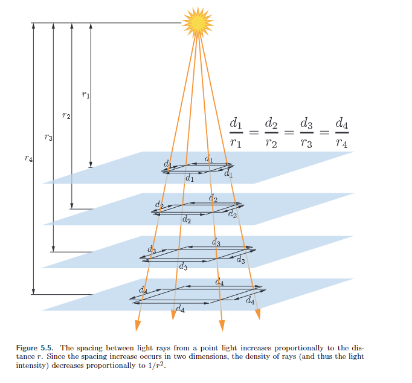
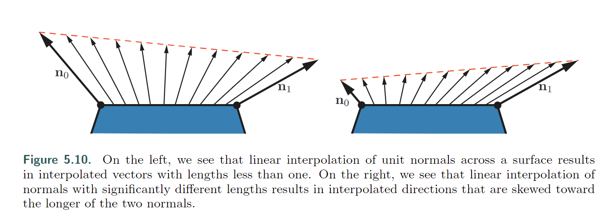

# Chapter 5 Shading Basics

三维物体的图像呈现在平面上，不仅几何图形需要正确，图片的视觉效果应该也符合期望。下图是两种风格的渲染。本章将讨论有关于着色渲染的部分知识。第15章专门讨论风格化渲染，而本书的重要部分，第9章至第14章，侧重于常用于照片般逼真渲染的基于物理的方法。

## 5.1 Shading Models

渲染首先肯定要选择在什么东西上渲染，然后再在这个东西上根据表面方向，视角，光照来确定这个东西的表面颜色。

现在有个来自十五章，非真实化风格渲染的例子，一个Gooch着色模型的变种。Gooch着色模型旨在提高技术插图中细节的可读性。

Gooch着色的基本思想是将表面法线与光源位置进行比较。如果法线指向光源，使用较暖的色调来着色表面；如果法线指向远离光源的方向，使用较冷的色调。介于两者之间的角度会在这些色调之间进行插值，这些色调是基于用户提供的表面颜色。在这个例子中，我们给模型添加了一种风格化的“高光”效果，使表面看起来有光泽。图5.2展示了着色模型的效果。

在这里例子中：着色是受到了视角，光照方向，表面法线的影响。在计算着色模型的输入时，这些通常会被定义成单位向量的输入，如图5.3所示：

现在我们已经定义了着色模型的所有输入，我们可以看一下模型本身的数学定义：

$$c_{shaded} = s c_{highlight} + (1 − s) (t c_{warm} + (1 − t) c_{cool} ). (5.1)$$

然后代入一些值，

计算**s**会用到向量点积。然后是在0-1之间使用线性插值（$$tc_a + (1 − t)c_b$$）,5.1中插值计算了2次。线性插值在代码中通常会以lerp或mix函数出现。

$$\mathbf{\textcolor{black}{r}} = 2(\mathbf{\textcolor{black}{n}}\cdot\mathbf{\textcolor{black}{l}})\mathbf{\textcolor{black}{n}}-\mathbf{\textcolor{black}{l}}$$这一行代码计算了反射光线向量，将光线l关于法线n进行反射。虽然不像前两个操作那样常见，但大多数着色语言也都内置了反射函数。

通过以不同的方式组合这些操作，结合各种数学表达式和着色参数，可以定义出各种风格化和逼真的着色模型。

修改到这里了。TODO:

------------------------------------------------------------

## 5.2 Light Sources 

光照对我们的示例着色模型的影响非常简单，它为着色提供了一个主导方向。当然，在现实世界中，光照可能非常复杂。可能存在多个光源，每个光源都有自己的大小、形状和颜色和强度；间接照明则增加了更多的变化。正如我们将在第9章中看到的那样，基于物理的逼真着色模型需要考虑所有这些参数。

相比之下，风格化的着色模型可以根据应用和视觉风格的需求以许多不同的方式使用照明。一些高度风格化的模型可能根本没有照明的概念，或者（像我们的Gooch着色示例一样）只是用它来提供一些简单的方向性。

**光照复杂性的下一步是让着色模型以二进制方式对光的存在或缺失做出反应。**使用这种模型进行着色的表面在受到光照时会呈现一种外观，在没有受到光照时会呈现不同的外观。这意味着需要一些标准来区分这两种情况：与光源的距离、阴影（将在第7章中讨论）、表面是否背离光源（即表面法线n与光矢量l之间的角度大于90°），或者这些因素的某种组合。

从光的二进制存在与不存在到光强度的连续刻度只是一个小小的步骤。这可以表示为缺失和完全存在之间的简单插值，这意味着强度的范围是有限的，可能是从0到1，或者是一个无限的数量，以某种其他方式影响着阴影。后者的常见选择是将阴影模型分为有光和无光部分，其中光强度$k_light$线性地缩放有光部分：

未照亮的部分$f_{unlit}(n, v)$对应于将光视为二进制的着色模型的“未受光影响时的外观”。它可以有不同的形式，取决于所需的视觉风格和应用的需求。例如，$f_{unlit}()$= (0, 0, 0)将导致任何未受光源影响的表面呈纯黑色。或者，未照亮的部分可以表达一些形式的风格化外观，类似于Gooch模型中面向光源的表面的冷色。通常，着色模型的这一部分表达的是一些不直接来自明确放置的光源的光照，例如来自天空或从周围物体反射的光。这些其他形式的光照将在第10章和第11章中讨论。

我们之前提到，如果光线的方向l与表面法线n的夹角大于90°，即从表面下方来的光线，那么光源不会对表面点产生影响。这可以被看作是光线方向相对于表面的一般关系的特殊情况，并且可以从简单的几何原理推导出来。尽管基于物理，但这种关系对于许多非基于物理的风格化着色模型也很有用。

光线对表面的影响可以被视为一组射线，**射线密度与表面上的光强度相对应，用于表面着色**。请参见图5.4，该图显示了照亮表面的横截面。沿着该横截面击中表面的光线之间的间距与l和n之间的角度的余弦成反比。因此，击中表面的光线的总密度与l和n之间的角度的余弦成正比，正如我们之前所看到的，这等于这两个单位向量的点积。这就是为什么定义光矢量l与光的传播方向相反是方便的原因；否则，在进行点积之前，我们必须对其进行取反。

更准确地说，光线密度（因此光线对阴影的贡献）与点积成正比。负值对应于来自表面后方的光线，对其没有影响。因此，在将光线的阴影乘以光照的点积之前，我们需要将点积限制在0以上。使用在1.2节中介绍的x+符号，表示将负值限制为零，我们有

支持多光源的着色模型通常使用方程5.5中的一种结构，这是更通用的结构，或者使用方程5.6，这是物理模型所必需的。这对于风格化模型也是有优势的，因为它有助于确保整体上的照明一致性，特别是对于远离光源或被阴影遮挡的表面。然而，有些模型不适合使用该结构；这些模型将使用方程5.5中的结构。

flit()函数最简单的选择是将其设为一个固定的颜色。

这个模型的亮部对应于兰伯特着色模型，兰伯特于1760年发表了这个模型！该模型适用于理想的漫反射表面，即完全无光泽的表面。我们在这里提供了一个稍微简化的兰伯特模型的解释，在第9章中将更加严谨地介绍。兰伯特模型可以单独用于简单的着色，并且它是许多着色模型中的关键组成部分。从方程5.3-5.6可以看出，光源通过两个参数与着色模型进行交互：指向光源的向量l和光源颜色clight。有各种不同类型的光源，这两个参数在场景中的变化主要有所不同。

我们接下来将讨论几种流行的光源类型，它们有一个共同点：在给定的表面位置上，每个光源只从一个方向照亮表面。换句话说，从阴影表面位置看，光源是一个无限小的点。这对于现实世界的光源来说并不严格正确，但大多数光源相对于照亮表面的距离来说都很小，因此这是一个合理的近似。在第7.1.2节和第10.1节中，我们将讨论从多个方向照亮表面位置的光源，**即“面光源”。**

### 5.2.1 Directional Lights

定向光是光源的最简单模型。在场景中，l和clight都是常数，除非clight受到阴影的衰减。定向光没有位置。当然，实际的光源在空间中有具体的位置。定向光是一种抽象，当光源到场景的距离相对于场景的大小很大时，它们能很好地工作。例如，一个距离小桌面景物20英尺的洪灯可以表示为定向光。另一个例子是几乎任何由太阳照亮的场景，除非是太阳系内部行星等特殊情况。

定向光的概念可以在保持光线方向l恒定的情况下，对$c_{light}$的值进行一定程度的扩展。这通常是为了性能或创意原因，将光的效果限制在场景的特定部分。例如，可以使用两个嵌套的（一个在另一个内部）盒状体来定义一个区域，在外部盒子之外，$c_{light}$等于（0, 0, 0）（纯黑色），在内部盒子内部等于某个常数值，并在两个盒子之间的区域中平滑地插值这些极端值。

### 5.2.2 Punctual Lights

一个准时的光源并不是指按时赴约的光源，而是指具有位置的光源，与定向光源不同。这样的光源没有尺寸，没有形状或大小，不像现实世界的光源。我们使用拉丁语“punctus”（意为“点”）一词来表示所有发光源的类别，这些发光源都来自一个单一的本地位置。我们使用术语“点光源”来指代一种特定的发射器，它在所有方向上均均匀发光。因此，点光源和聚光灯是两种不同形式的点光源。光线方向向量l根据当前着色表面点$p_0$相对于点光源位置$p_{light}$的位置而变化。

这个方程是向量归一化的一个例子：通过将向量除以其长度来产生一个指向相同方向的单位长度向量。这是另一种常见的着色操作，就像我们在前一节中看到的着色操作一样，它是大多数着色语言中的内置函数。然而，有时需要从这个操作中得到一个中间结果，这需要使用更基本的操作，通过多个步骤明确地进行归一化。将这应用于点光源方向计算，我们得到以下结果：

由于两个向量的点积等于两个向量长度的乘积与它们之间夹角的余弦值，而0度的余弦值为1.0，所以一个向量与自身的点积就是它的长度的平方。因此，要找到任意向量的长度，我们只需将其与自身进行点积，并取结果的平方根。我们需要的中间值是r，即点光源与当前阴影点之间的距离。除了在归一化光矢量中使用，r的值还用于计算光颜色$c_light$随距离的衰减（变暗）。这将在下一节中进一步讨论。

-------------------------------

Point/Omni Lights

发射均匀光线的准时灯被称为点光源(point lights)或全向光源(omni lights)。对于点光源，光强$c_{light}$随距离r的变化而变化，唯一的变化源是上面提到的距离衰减。图5.5展示了为什么会出现这种变暗现象，使用了与图5.4中余弦因子演示类似的几何推理。在给定的表面上，从点光源发出的光线之间的间距与表面到光源的距离成比例。与图5.4中的余弦因子不同，这种间距增加发生在表面的两个维度上，因此光线密度（以及光颜色$c_{light}$）与倒数平方距离1/r2成比例。这使我们能够用一个单一的光属性$c_{light_0}$来指定$c_{light}$的空间变化，$c_{light_0}$被定义为在固定参考距离r0处的$c_{light}$值。

方程5.11通常被称为反比平方光衰减。虽然从技术上讲，这是点光源的正确距离衰减，但存在一些问题使得这个方程在实际着色中不太理想。第一个问题出现在相对较小的距离上。当r的值趋近于0时，clight的值会以无限的方式增加。当r达到0时，我们将会遇到除以零的奇点。为了解决这个问题，一种常见的修改方法是在分母上添加一个小值$\epsilon$。

ǫ的确切值取决于应用程序；例如，虚幻游戏引擎使用$\epsilon= 1$厘米[861]。另一种修改方法，在CryEngine [1591]和Frostbite [960]游戏引擎中使用，是将$\epsilon$限制在最小值rmin。

与先前方法中使用的有些任意的ε值不同，rmin的值具有物理解释：发光物体的半径。小于rmin的r值对应于穿透物理光源内部的阴影表面，这是不可能的。

相比之下，反比平方衰减的第二个问题发生在相对较远的距离上。问题不在于视觉，而在于性能。尽管光强度随着距离的增加而减小，但它永远不会降为0。为了有效渲染，希望光在某个有限距离上达到0强度（第20章）。有许多不同的方式可以修改反比平方方程以实现这一点。理想情况下，修改应尽可能地引入最少的变化。为了避免在光的影响边界处出现急剧截断，修改函数的导数和值在同一距离上达到0也是可取的。一解决方案是将平方反比方程乘以具有所需属性的窗函数。 Unreal Engine [861] 和 Frostbite [960] 游戏引擎都使用这样一个函数 [860]：

+2 表示在对其进行平方之前将值（如果为负）限制为 0。图 5.6 显示了平方反比曲线示例、公式 5.14 中的窗口函数以及两者相乘的结果。应用要求将影响所用方法的选择。例如，当以相对较低的空间频率（例如，在光照贴图或每个顶点中）对距离衰减函数进行采样时，rmax 处的导数等于 0 特别重要。 CryEngine 不使用光照贴图或顶点光照，因此它采用了更简单的调整，切换到 0.8rmax 和 rmax 之间的线性衰减[1591]。

应用需求将影响所使用的方法选择。例如，在距离衰减函数以相对较低的空间频率采样时（例如，在光照贴图或每个顶点中），使导数在rmax处等于0尤为重要。CryEngine不使用光照贴图或顶点光照，因此它采用了更简单的调整方法，在0.8rmax和rmax之间切换到线性衰减。

对于某些应用程序来说，匹配倒数平方曲线并不是一个优先考虑的问题，因此会使用完全不同的其他函数。这实际上将方程5.11-5.14推广为以下形式。

其中$f_{dist}(r)$是距离的某个函数。这些函数被称为距离衰减函数。在某些情况下，使用非倒数平方衰减函数是由性能限制驱动的。例如，游戏《正当防卫2》需要计算成本非常低廉的灯光。这就要求使用一个简单计算的衰减函数，同时又足够平滑以避免顶点光照的伪影[1379]。

在其他情况下，衰减函数的选择可能受到创造性考虑的驱动。例如，用于逼真和风格化游戏的虚幻引擎有两种光衰减模式：一个是根据方程式5.12描述的反平方模式，另一个是指数衰减模式，可以调整以创建各种衰减曲线[1802]。《古墓丽影》（2013）游戏的开发人员使用样条编辑工具来制作衰减曲线[953]，从而可以更好地控制曲线形状。

-----------------

Spotlights

与点光源不同，几乎所有现实世界的光源的照明强度不仅随距离变化，还随方向变化。这种变化可以用方向衰减函数$f_{dir}(l)$来表示，它与距离衰减函数结合，定义了光强的整体空间变化。

不同的$f_{dir}(l)$选择可以产生各种照明效果。一个重要的效果是聚光灯，它将光投射成一个圆锥体。聚光灯的方向衰减函数具有围绕聚光灯方向向量s的旋转对称性，因此可以表示为聚光灯方向向量s与反向光矢量-l到表面之间的角度θs的函数。需要反转光矢量，因为我们将表面上的l定义为指向光源，而这里我们需要指向远离光源的矢量。

大多数聚光灯功能使用由θs的余弦组成的表达式，这是着色中角度的最常见形式（正如我们之前所见）。聚光灯通常具有一个阴影角度θu，该角度限制了光线，使得对于所有θs ≥ θu，fdir（l）= 0。这个角度可以像之前看到的最大衰减距离rmax一样用于剔除。聚光灯通常还具有一个半影角度θp，它定义了一个内锥体，在这个锥体内光线的强度达到最大。参见图5.7。

各种方向衰减函数用于聚光灯，但它们倾向于大致相似。例如，Frostbite游戏引擎中使用函数$f_{dir_F}(l)$，而three.js浏览器图形库中使用函数$f_{dir_T}（l）$[960] [218]。

回想一下，x+是我们在1.2节中介绍的将x限制在0和1之间的符号表示法。smoothstep函数是一个常用于着色中平滑插值的三次多项式。它是大多数着色语言中的内置函数。图5.8展示了我们目前讨论过的一些光源类型。

-----------------

Other Punctual Lights

有许多其他方式可以改变一个点光源的亮度值。fdir(l)函数不仅限于上述讨论的简单聚光灯衰减函数；它可以表示任何类型的方向变化，包括从真实光源测量得到的复杂表格模式。照明工程学会（IES）已经为此类测量定义了标准文件格式。IES文件可以从许多照明制造商处获得，并已在游戏《Killzone: Shadow Fall》[379, 380]以及Unreal [861]和Frostbite [960]游戏引擎中使用，等等。Lagarde [961]对解析和使用这种文件格式的问题进行了很好的总结。游戏《古墓丽影》（2013）[953]有一种类型的点光源，它在x、y和z世界轴上应用独立的衰减函数。在《古墓丽影》中，曲线也可以应用于随时间变化的光强度，例如产生闪烁的火炬。在第6.9节中，我们将讨论如何通过使用纹理来改变光强度和颜色。

### 5.2.3 Other Light Types

定向光和点光主要通过计算光线方向l来进行特征化。可以通过使用其他方法来计算光线方向来定义不同类型的光源。例如，除了之前提到的光源类型，古墓丽影还使用胶囊光源，其使用线段作为光源而不是点[953]。对于每个有阴影的像素，使用到线段上最近点的方向作为光线方向l。

**只要着色器具有用于评估着色方程的l和clight值，就可以使用任何方法来计算这些值。**到目前为止讨论的光源类型都是抽象的。实际上，光源具有大小和形状，并且它们从多个方向照亮表面点。在渲染中，这种光源被称为面光源，它们在实时应用中的使用正在稳步增加。面光渲染技术分为两类：模拟面光部分遮挡导致阴影边缘变软的技术（第7.1.2节），以及模拟面光对表面着色的影响的技术（第10.1节）。对于光滑的镜面表面，第二类光照效果最为明显，可以清楚地看到光源的形状和大小在其反射中。定向光和点光源不太可能被淘汰，尽管它们不再像过去那样普遍存在。已经开发出考虑光源面积的近似方法，这些方法实现起来相对廉价，因此得到了更广泛的应用。增加的GPU性能也使得比过去更复杂的技术成为可能。

## 5.3 Implementing Shading Models

为了有用，这些阴影和光照方程当然必须在代码中实现。在本节中，我们将介绍设计和编写这些实现的一些关键考虑因素。我们还将通过一个简单的实现示例进行演示。

### 5.3.1 Frequency of Evaluation

在设计着色实现时，需要根据计算的评估频率进行划分。首先，确定给定计算的结果是否在整个绘制调用过程中始终保持不变。在这种情况下，计算可以由应用程序执行，通常在CPU上执行，尽管GPU计算着色器可以用于特别昂贵的计算。结果通过统一的着色器输入传递给图形API。

即使在这个类别中，评估的频率也有很大的范围，从“从不”开始。最简单的情况是在着色方程中有一个恒定的子表达式，但这也适用于基于很少改变的因素（如硬件配置和安装选项）的任何计算。这样的着色计算可能在着色器编译时解决，这种情况下甚至不需要设置统一的着色器输入。或者，计算可以在离线预计算阶段、安装时或应用程序加载时执行。

另一个情况是当着色计算的结果在应用程序运行过程中发生变化，但变化非常缓慢，不需要每帧更新。例如，在虚拟游戏世界中，依赖于白天时间的光照因素。如果计算成本很高，可以将其分摊到多个帧上。

其他情况包括每帧执行一次的计算，例如连接视图和透视矩阵；或每个模型执行一次的计算，例如更新依赖于位置的模型光照参数；或每个绘制调用执行一次的计算，例如更新模型中每个材质的参数。按照计算频率对统一的着色器输入进行分组对于应用程序的效率很有用，并且还可以通过最小化常量更新来提高GPU性能[1165]。

如果在绘制调用中，着色计算的结果发生变化，就不能通过统一的着色器输入传递给着色器。相反，它必须由第三章中描述的可编程着色器阶段之一进行计算，并且如果需要，通过可变的着色器输入传递给其他阶段。理论上，着色计算可以在任何可编程阶段上执行，每个阶段对应不同的评估频率。

- 顶点着色器-每个预细分顶点进行评估。 
- 曲面细分着色器-每个曲面片段进行评估。 
- 域着色器-每个细分后的顶点进行评估。
- 几何着色器 - 每个基元进行评估。 
- 像素着色器 - 每个像素进行评估。

实际上，大多数着色计算都是按像素执行的。虽然这些通常在像素着色器中实现，但计算着色器的实现也越来越常见。第 20 章将讨论几个例子。其他阶段主要用于几何操作，例如变换和变形。为了理解为什么会出现这种情况，我们将比较每顶点和每像素着色评估的结果。在较早的文本中，这些有时分别被称为 Gouraud 着色 [578] 和 Phong 着色 [1414]，尽管这些术语现在不常用。此比较使用的着色模型与公式 5.1 中的模型有些相似，但经过修改以适用于多个光源。稍后，当我们详细介绍示例实现时，将给出完整的模型。

图5.9展示了在具有不同顶点密度的模型上进行逐像素和逐顶点着色的结果。对于龙这样的极密集网格，两者之间的差异很小。但是在茶壶上，顶点着色评估会导致可见的错误，如角形高光，并且在两个三角形平面上，顶点着色的版本明显是错误的。这些错误的原因是着色方程的某些部分，特别是高光部分，在网格表面上具有非线性变化的值。这使得它们不适合顶点着色器，其结果在三角形上进行线性插值后再传递给像素着色器。

原则上，可以在像素着色器中仅计算光泽高光部分的着色模型，并在顶点着色器中计算其余部分。这可能不会导致视觉伪影，并且理论上可以节省一些计算。实际上，这种混合实现通常不是最优的。着色模型中线性变化的部分往往是计算成本最低的，以这种方式拆分着色计算往往会增加足够的开销，如重复计算和额外的变化输入，以抵消任何好处。正如我们之前提到的，在大多数实现中，顶点着色器负责非着色操作，如几何变换和变形。生成的几何表面属性被转换为适当的坐标系，并由顶点着色器写出，线性插值在三角形上，并作为变化的着色器输入传递到像素着色器中。这些属性通常包括表面的位置、表面法线，以及如果需要法线映射的话，可选的表面切线向量。

请注意，即使顶点着色器总是生成单位长度的表面法线，插值操作也会改变它们的长度。请参见图5.10的左侧。因此，法线在像素着色器中需要重新归一化（缩放为长度1）。然而，顶点着色器生成的法线长度仍然很重要。如果法线长度在顶点之间有显著变化，例如由于顶点混合的副作用，这将使插值产生偏斜。请参见图5.10的右侧。由于这两种影响，实现通常会在插值之前和之后对插值向量进行归一化处理，即在顶点着色器和像素着色器中都进行处理。

与表面法线不同，指向特定位置的向量（如视图向量和点光源的光向量）通常不进行插值。相反，插值后的表面位置在像素着色器中用于计算这些向量。除了归一化，正如我们已经看到的，在任何情况下都需要在像素着色器中执行，每个向量都通过向量减法进行计算，这是快速的。

如果由于某种原因需要对这些向量进行插值，不要事先对它们进行归一化。这将导致错误的结果，如图5.11所示。

前面我们提到顶点着色器将表面几何体转换为“适当的坐标系统”。相机和光源位置通过统一变量传递给像素着色器，通常由应用程序将它们转换为相同的坐标系统。这样做可以最大限度地减少像素着色器的工作量，将所有着色模型的向量带入相同的坐标空间中。但是，“适当”的坐标系统是哪一个？可能的选择包括全局世界空间以及相机的局部坐标系统，更少见的是当前渲染模型的坐标系统。选择通常是基于整个渲染系统的系统性考虑，如性能、灵活性和简单性。例如，如果渲染场景预计包含大量光源，可能会选择使用世界空间，以避免对光源位置进行转换。或者，可能更倾向于相机空间，以更好地优化与视图向量相关的像素着色器操作，并可能改善精度（第16.6节）。

尽管大多数着色器实现（包括我们即将讨论的示例实现）都遵循上述概述的一般步骤，但也有一些例外情况。例如，出于风格原因，一些应用程序选择每个基本图元进行分面着色评估的外观。这种风格通常被称为“平面着色”。图5.12中显示了两个示例。原则上，平面着色可以在几何着色器中执行，但最近的实现通常使用顶点着色器。这是通过将每个基本图元的属性与其第一个顶点关联并禁用顶点值插值来实现的。禁用插值（可以分别对每个顶点值进行）会导致第一个顶点的值传递给图元中的所有像素。

### 5.3.2 Implementation Example

### 5.3.3 Material Systems

渲染框架很少只实现一个单一的着色器，就像我们的简单示例一样。通常，需要一个专用系统来处理应用程序使用的各种材质、着色模型和着色器。正如前几章所解释的，着色器是GPU可编程着色器阶段之一的程序。因此，它是一个低级别的图形API资源，而不是艺术家直接交互的对象。相比之下，材质是艺术家面向的封装了表面视觉外观的对象。材质有时也描述非视觉方面，例如碰撞属性，由于超出了本书的范围，我们将不再讨论。

尽管材料是通过着色器实现的，但这并不是简单的一对一对应关系。在不同的渲染情况下，同一种材料可能使用不同的着色器。一个着色器也可以被多个材料共享。最常见的情况是参数化材料。在最简单的形式中，材料参数化需要两种类型的材料实体：材料模板和材料实例。每个材料模板描述了一类材料，并具有一组参数，这些参数可以根据参数类型分配数值、颜色或纹理值。每个材料实例对应于一个材料模板加上其所有参数的特定值。一些渲染框架，如虚幻引擎[1802]，允许更复杂的分层结构，其中材料模板从多个级别的其他模板派生。

参数可以在运行时解析，通过将统一的输入传递给着色器程序，或者在编译时通过替换值来进行。一种常见的编译时参数是一个布尔开关，用于控制给定材质特性的激活。艺术家可以通过材质用户界面中的复选框设置这个开关，或者通过材质系统进行程序化设置，例如在视觉效果可以忽略的情况下，减少远处物体的着色器成本。

虽然材质参数可能与着色模型的参数一一对应，但并不总是如此。材质可以将给定的着色模型参数的值固定为一个常数值，例如表面颜色。或者，着色模型参数可以作为多个材质参数以及插值的顶点或纹理值作为输入的一系列复杂操作的结果进行计算。在某些情况下，表面位置、表面方向甚至时间等参数也可能影响计算。基于表面位置和方向的着色在地形材质中特别常见。例如，可以使用高度和表面法线来控制雪效果，在高海拔水平和几乎水平的表面上混合白色表面颜色。基于时间的着色在动画材质中很常见，比如闪烁的霓虹灯标志。

材料系统的一个最重要的任务是将各种着色器函数分成单独的元素，并控制它们的组合方式。这种组合在许多情况下都非常有用，包括以下情况：

- 将表面着色与几何处理结合，如刚性变换、顶点混合、变形、细分、实例化和裁剪。这些功能的组合是独立的：表面着色取决于材质，几何处理取决于网格。因此，将它们分开进行编写，并由材质系统根据需要进行组合是很方便的。
- 使用像素丢弃和混合等合成操作来组合表面着色。这对于移动GPU特别重要，因为混合通常在像素着色器中执行。通常希望独立选择这些操作，而不受表面着色所使用的材料的影响。
- 将用于计算着色模型参数的操作与着色模型本身的计算组合在一起。这样一来，可以编写一次着色模型实现，并将其与各种不同的方法结合使用来计算着色模型参数。
- 将可单独选择的材质特性与选择逻辑以及着色器的其余部分组合在一起。这样可以分别编写每个特性的实现。
- 使用光源评估来组合着色模型并计算其参数：为每个光源在阴影点计算clight和l的值。诸如延迟渲染（在第20章中讨论）之类的技术改变了这种组合的结构。在支持多种此类技术的渲染框架中，这增加了额外的复杂性层次。

如果图形API提供了这种类型的着色器代码模块化作为核心功能，那将非常方便。不幸的是，与CPU代码不同，GPU着色器不允许对代码片段进行后编译链接。每个着色器阶段的程序都被编译为一个单元。着色器阶段之间的分离确实提供了一定的有限模块化，这在某种程度上符合我们列表中的第一项：将表面着色（通常在像素着色器中执行）与几何处理（通常在其他着色器阶段中执行）组合。但这种匹配并不完美，因为每个着色器还执行其他操作，并且其他类型的组合仍然需要处理。鉴于这些限制，材质系统实现所有这些类型的组合的唯一方法是在源代码级别进行。这主要涉及字符串操作，如连接和替换，通常通过C风格的预处理指令（如#include，#if和#define）执行。

早期的渲染系统只有相对较少的着色器变体，通常每个变体都是手动编写的。这种方法有一些好处。例如，每个变体都可以在完全了解最终着色器程序的情况下进行优化。然而，随着变体数量的增加，这种方法很快变得不切实际。考虑到所有不同的部分和选项，可能的着色器变体数量是巨大的。这就是为什么模块化和可组合性如此重要的原因。

在设计处理着色器变体的系统时，首先要解决的问题是选择不同选项是通过动态分支在运行时进行，还是通过条件预处理在编译时进行。在旧的硬件上，动态分支通常是不可能或者非常慢的，因此运行时选择不是一个选择。变体然后在编译时处理，包括不同光源类型的所有可能组合的数量[1193]。

相比之下，**当前的GPU在处理动态分支方面表现得很好**，尤其是当分支在绘制调用中的所有像素上的行为相同时。如今，许多功能变化，例如灯光数量，都是在运行时处理的。然而，向着色器添加大量的功能变化会产生不同的代价：寄存器数量增加，占用率相应减少，从而影响性能。请参阅第18.4.5节以获取更多详细信息。因此，编译时变化仍然很有价值。它避免了包含永远不会执行的复杂逻辑。

举个例子，让我们想象一个支持三种不同类型灯光的应用程序。其中两种灯光类型很简单：点光源和定向光源。第三种类型是一个通用的聚光灯，支持表格化的照明模式和其他复杂功能，需要大量的着色器代码来实现。然而，假设通用聚光灯在应用程序中相对较少使用，不到5%的灯光是这种类型。过去，为了避免动态分支，会为三种灯光类型的每种可能组合编译单独的着色器变体。虽然现在不再需要这样做，但为通用聚光灯的数量等于或大于1的情况编译一个单独的变体，以及为这种灯光数量恰好为0的情况编译另一个单独的变体可能仍然有益。由于代码更简单，第二个变体（最常用的）可能具有较低的寄存器占用率，从而具有更高的性能。

现代材料系统同时使用运行时和编译时的着色器变体。尽管完全的负担不再仅在编译时处理，但整体复杂性和变体数量仍在不断增加，因此仍需要编译大量的着色器变体。例如，在游戏《命运：夺魂之王》的某些区域中，单帧使用了超过9000个已编译的着色器变体。可能的变体数量可能更大，例如，Unity渲染系统具有接近1000亿个可能的变体。只有实际使用的变体才会被编译，但着色器编译系统必须重新设计以处理如此庞大的可能变体数量。

材料系统设计师采用不同的策略来解决这些设计目标。尽管有时被呈现为互相排斥的系统架构[342]，但这些策略通常会在同一个系统中被结合使用。这些策略包括以下内容：

- 代码重用-在共享文件中实现函数，使用#include预处理器指令从任何需要它们的着色器中访问这些函数。
- Subtractive ——一种经常被称为ubershader或supershader [1170, 1784]的着色器，它通过使用编译时预处理条件和动态分支来聚合大量功能，以删除未使用的部分并在互斥的替代方案之间切换。
- Additive——各种功能被定义为具有输入和输出连接器的节点，并将它们组合在一起。这类似于代码重用策略，但更加结构化。节点的组合可以通过文本[342]或可视化图形编辑器完成。后者旨在使非工程师（如技术艺术家）更容易创建新的材质模板[1750，1802]。通常，只有着色器的一部分可以通过可视化图形编辑器进行访问。例如，在虚幻引擎中，图形编辑器只能影响着色模型输入的计算[1802]。参见图5.13。

- 基于模板的——定义了一个接口，可以将不同的实现插入其中，只要它们符合该接口。这比增量策略更正式，通常用于更大的功能块。一个常见的例子是计算着色模型参数和计算着色模型本身之间的分离。虚幻引擎[1802]有不同的“材质域”，包括用于计算着色模型参数的表面域和用于计算给定光源的调制光的标量值的光函数域。Unity[1437]中也存在类似的“表面着色器”结构。请注意，延迟着色技术（在第20章中讨论）强制使用类似的结构，其中G缓冲器充当接口。

对于更具体的例子，(现在免费的)书籍《WebGL In-sights》[301]的几个章节讨论了各种引擎如何控制它们的着色器流水线。除了组合之外，现代材质系统还有几个其他重要的设计考虑因素，例如需要支持多个平台，并且尽量减少着色器代码的重复。这包括根据平台、着色语言和API之间的性能和功能差异来进行功能变化。Destiny着色器系统[1750]是这类问题的一个典型解决方案。它使用专有的预处理器层，可以接受用自定义着色语言方言编写的着色器。这样可以编写与平台无关的材质，并自动转换为不同的着色语言和实现。Unreal Engine [1802]和Unity [1436]也有类似的系统。

材质系统还需要确保良好的性能。除了对着色变体进行专门编译之外，材质系统还可以进行一些其他常见的优化。《命运》着色器系统和虚幻引擎可以自动检测在绘制调用中保持不变的计算（例如之前实现示例中的暖色和冷色计算），并将其移出着色器。另一个例子是《命运》中使用的作用域系统，用于区分在不同频率（例如每帧一次，每个光源一次，每个物体一次）更新的常量，并在适当的时间更新每组常量以减少API开销。

正如我们所见，实现着色方程是决定哪些部分可以简化、计算各种表达式的频率以及用户如何修改和控制外观的问题。渲染管道的最终输出是颜色和混合值。关于抗锯齿、透明度和图像显示的其余部分详细说明了这些值如何组合和修改以进行显示。

## 5.4 Aliasing and Antialiasing

想象一个大黑色三角形在白色背景上缓慢移动。当屏幕网格单元被三角形覆盖时，代表该单元的像素值应该平滑地降低强度。在各种基本渲染器中通常发生的是，一旦网格单元的中心被覆盖，像素颜色立即从白色变为黑色。标准的GPU渲染也不例外。请参见图5.14的最左列。

三角形在像素中要么存在，要么不存在。绘制的线条也有类似的问题。由于这个原因，边缘看起来有锯齿状，因此这种视觉缺陷被称为“锯齿”，当动画时则变成“爬行”。更正式地说，这个问题被称为走样，避免走样的努力被称为抗锯齿技术。

采样理论和数字滤波的主题足够大，可以写满一本书[559,1447,1729]。由于这是渲染的关键领域，因此将介绍采样和过滤的基本理论。然后，我们将重点关注当前可以实时采取哪些措施来减轻锯齿现象。

### 5.4.1 Sampling and Filtering Theory

**渲染图像的过程本质上是一个采样任务**。这是因为生成图像的过程是对三维场景进行采样，以获得图像中每个像素的颜色值（离散像素数组）。为了在不同条件下获得良好的结果，使用纹理映射（第6章）时需要对纹素进行重新采样。为了生成动画中的一系列图像，通常会以均匀的时间间隔对动画进行采样。本节是关于采样、重建和滤波的主题的介绍。

为了简化起见，大部分材料将以一维形式呈现。这些概念也可以自然地扩展到二维，并且可以在处理二维图像时使用。图5.15展示了连续信号如何在均匀间隔的时间点进行采样，即离散化。采样过程的目标是将信息以数字形式表示。在这样做的过程中，信息的量被减少了。然而，采样信号需要经过重建才能恢复原始信号。这是通过对采样信号进行滤波来实现的。

每当进行采样时，可能会发生混叠现象。这是一种不希望出现的伪影，我们需要对抗混叠以生成令人愉悦的图像。在旧西部片中经常出现的一个经典例子是电影摄像机拍摄的旋转马车车轮。由于车轮的辐条移动速度比摄像机记录图像的速度快得多，车轮可能看起来在缓慢旋转（向前或向后），甚至可能看起来根本不在旋转。这可以在图5.16中看到。这种效果是因为车轮的图像是在一系列时间步骤中拍摄的，被称为时间混叠（temporal aliasing）。

计算机图形中常见的aliasing现象包括光栅化线条或三角形边缘的“锯齿”、闪烁的高光点称为“萤火虫”，以及当具有棋盘格纹理的图像被缩小时。

混叠现象发生在信号被以过低的频率采样时。采样后的信号看起来比原始信号的频率要低。这在图5.17中有所说明。为了正确地对信号进行采样（即从采样中能够重构出原始信号），**采样频率必须大于被采样信号的最大频率的两倍。这通常被称为采样定理，采样频率被称为奈奎斯特频率**[1447]或奈奎斯特限制，以纪念于1928年发现这一定理的瑞典科学家哈里·奈奎斯特（1889-1976）。奈奎斯特限制也在图5.16中有所说明。定理中使用“最大频率”一词意味着信号必须是带限的，即意味着没有任何超过某个限制的频率。换句话说，信号相对于相邻样本之间的间距必须足够平滑。

5.4.2 Screen-Based Antialiasing

如果不对三角形的边缘进行良好的采样和滤波，会产生明显的伪影。阴影边界、镜面高光和其他颜色迅速变化的现象也会导致类似的问题。本节讨论的算法有助于改善这些情况下的渲染质量。它们的共同特点是基于屏幕的，即它们仅在管道的输出样本上操作。没有一种最好的抗锯齿技术，因为每种技术在质量、捕捉清晰细节或其他现象的能力、运动中的外观、内存成本、GPU要求和速度方面都有不同的优势。

在图5.24中的黑色三角形示例中，一个问题是采样率低。每个像素的网格单元只取一个样本，因此对于该单元格，我们只知道中心是否被三角形覆盖。通过在每个屏幕网格单元中使用更多的样本，并以某种方式混合这些样本，可以计算出更好的像素颜色。这在图5.24中有所说明。

屏幕抗锯齿方案的一般策略是使用采样模式来对屏幕进行采样，然后对样本进行加权求和以产生像素颜色p。

其中n是取样像素的数量。函数c(i, x, y)是一个样本颜色，wi是一个权重，取值范围为[0, 1]，样本将对整体像素颜色产生贡献。样本位置是根据它在序列1, ..., n中的位置来确定的，函数还可以选择使用像素位置(x, y)的整数部分。换句话说，样本在屏幕网格上的位置对于每个样本都是不同的，而且采样模式可以在像素之间变化。在实时渲染系统（以及大多数其他渲染系统）中，样本通常是点样本。因此，函数c可以被认为是两个函数。首先，函数f(i, n)检索需要样本的屏幕上的浮点（xf，yf）位置。然后对该位置进行采样，即检索该精确点的颜色。采样方案是选择的，并且渲染流水线被配置为在特定的亚像素位置计算样本，通常基于每帧（或每个应用程序）的设置。

抗锯齿中的另一个变量是wi，即每个样本的权重。这些权重总和为一。大多数实时渲染系统中使用的方法给予它们的样本一个均匀的权重，即wi = 1/n。图形硬件的默认模式是在像素中心进行单个采样，这是抗锯齿方程的最简单情况。只有一个项，该项的权重为一，采样函数f始终返回被采样像素的中心。

超采样（或过采样）方法是计算每个像素超过一个完整样本的抗锯齿算法。概念上最简单的全场景抗锯齿（FSAA），也称为“超采样抗锯齿”（SSAA），在更高的分辨率下渲染场景，然后对相邻样本进行滤波以创建图像。例如，假设需要一个1280×1024像素的图像。如果在屏幕外渲染一个2560×2048的图像，**然后对屏幕上的每个2×2像素区域进行平均，就可以生成所需的图像，每个像素有四个样本**，并使用盒状滤波器进行滤波。请注意，这对应于图5.25中的2×2网格采样。这种方法成本高昂，因为所有子样本都必须完全着色和填充，并具有每个样本的z缓冲深度。FSAA的主要优点是简单性。该方法的其他低质量版本在一个屏幕轴上以两倍的速率进行采样，因此被称为1×2或2×1超采样。通常使用2的幂次方分辨率和盒状滤波器以保持简单。NVIDIA的动态超分辨率功能是超采样的一种更复杂形式，其中场景以更高的分辨率渲染，并使用13个样本的高斯滤波器生成显示的图像[1848]。

与超采样相关的一种采样方法基于累积缓冲区的思想[637, 1115]。这种方法不使用一个大的离屏缓冲区，而是使用一个与所需图像具有相同分辨率但每个通道具有更多颜色位的缓冲区。为了获得场景的2×2采样，需要生成四个图像，根据需要将视图在屏幕x或y方向上移动半个像素。每个生成的图像都基于网格单元内的不同采样位置。每帧重新渲染场景并将结果复制到屏幕的额外成本使得这个算法在实时渲染系统中代价高昂。当性能不是关键因素时，它对于生成更高质量的图像很有用，因为每个像素可以使用任意数量的样本，放置在任何位置[1679]。累积缓冲区曾经是一个独立的硬件部件。它在OpenGL API中得到直接支持，但在3.0版本中被弃用。在现代GPU上，**可以通过在输出缓冲区中使用更高精度的颜色格式来实现累积缓冲区的概念。**

当物体边缘、镜面高光和锐利阴影引起突然的颜色变化时，需要额外的样本。阴影可以变得更柔和，高光可以变得更平滑，以避免混叠现象。特定的物体类型可以增加尺寸，例如电线，以确保它们在其长度的每个位置至少覆盖一个像素[1384]。**物体边缘的混叠仍然是一个主要的采样问题。**可以使用分析方法，在渲染过程中检测物体边缘并考虑它们的影响，但这些方法通常更昂贵且不够稳健，相比之下，增加更多的样本更为简单。然而，GPU的功能，如保守光栅化和光栅化器顺序视图，已经开辟了新的可能性[327]。

诸如超采样和累积缓冲等技术通过生成具有独立计算的阴影和深度的完全指定的样本来工作。总体收益相对较低，成本较高，因为每个样本都必须通过像素着色器运行。

多重采样抗锯齿（MSAA）通过每个像素计算一次表面的阴影并在样本之间共享结果，从而减少高计算成本。
每个片段可能有四个（x，y）采样位置的像素，每个位置都有自己的颜色和z深度，但是像素着色器仅对应用于像素的每个对象片段评估一次。如果所有MSAA位置采样都被片段覆盖，则在像素的中心评估阴影采样。如果片段覆盖的位置采样较少，则可以将阴影采样的位置移动以更好地表示所覆盖的位置。这样做可以避免在纹理边缘进行阴影采样，例如。如果启用，GPU会自动执行此位置调整，称为质心采样或质心插值。**质心采样避免了三角形外问题，但可能导致导数计算返回不正确的值[530, 1041]。请参见图5.26。**

MSAA比纯超采样方案更快，因为片段只进行一次着色。它将工作重点放在以更高的速率对片段的像素覆盖进行采样和共享计算的上面。通过进一步解耦采样和覆盖，可以节省更多内存，从而使抗锯齿速度更快——触及的内存越少，渲染速度越快。NVIDIA在2006年引入了覆盖采样抗锯齿（CSAA），而AMD则推出了增强质量抗锯齿（EQAA）。**这些技术通过以更高的采样率仅存储片段的覆盖来工作。**例如，EQAA的“2f4x”模式存储了两个颜色和深度值，共享在四个采样位置之间。颜色和深度不再存储在特定位置，而是保存在一个表中。然后，这四个样本只需要一个位来指定与其位置相关联的两个存储值之一。请参见图5.26。覆盖采样指定了每个片段对最终像素颜色的贡献。如果超过了存储的颜色数，将会剔除一个存储的颜色，并将其样本标记为未知。这些样本不会对最终颜色产生贡献[382, 383]。对于大多数场景来说，包含三个或更多可见不透明片段且它们在阴影上有明显差异的像素相对较少，因此这个方案在实践中表现良好[1405]。然而，为了获得最高质量，游戏《极限竞速：地平线2》选择了4× MSAA，尽管EQAA具有性能优势[1002]。

尽管这种类型的算法在为静态场景提供抗锯齿效果时不需要额外的采样成本，但在用于时域抗锯齿时会出现一些问题。如果帧没有被平等加权，静态场景中的物体可能会出现闪烁。快速移动的物体或快速的相机移动可能会导致幽灵效应，即由于之前帧的贡献而在物体后面留下的轨迹。解决幽灵效应的一种方法是仅对缓慢移动的物体执行此类抗锯齿操作[1110]**。另一个重要的方法是使用重新投影（**第12.2节）来更好地关联先前帧和当前帧的物体。在这种方案中，物体生成存储在单独的“速度缓冲区”（第12.5节）中的运动矢量。这些矢量用于将先前帧与当前帧进行关联，即从当前像素位置减去矢量以找到该物体表面位置的先前帧的颜色像素。不太可能是当前帧表面的样本将被丢弃[1912]。由于时域抗锯齿不需要额外的样本，因此相对较少的额外工作，近年来对这种类型的算法产生了浓厚的兴趣和广泛的采用。部分原因是因为延迟着色技术（第20.1节）与MSAA和其他多重采样支持不兼容[1486]。不同的方法因应用程序的内容和目标而异，已经开发出一系列的技术来避免伪影并提高质量[836, 1154, 1405, 1533, 1938]。例如，Wihlidal的演示[1885]展示了如何将EQAA、时域抗锯齿和各种滤波技术应用于棋盘格采样模式，以在降低像素着色器调用次数的同时保持质量。Iglesias-Guitian等人[796]总结了以前的工作，并提出了他们的方案，使用像素历史和预测来最小化滤波伪影。Patney等人[1357]在虚拟现实应用中扩展了Karis和Lottes关于虚幻引擎4实现的TAA工作[862]，增加了可变大小的采样以及对眼睛运动的补偿（第21.3.2节）。

Sampling Patterns

有效的采样模式是减少混叠、时间和其他干扰的关键因素。Naiman [1257] 表明，人类对近水平和近垂直边缘的混叠最为敏感。接下来是接近45度斜率的边缘。旋转网格超采样（RGSS）使用旋转的方形模式，在像素内提供更多的垂直和水平分辨率。图5.25显示了这种模式的一个示例。

RGSS模式是拉丁超立方体或N-rooks抽样的一种形式，其中n个样本被放置在一个n×n的网格中，每行和每列一个样本[1626]。在RGSS中，四个样本分别位于4×4子像素网格的不同行和列。与常规的2×2抽样模式相比，这种模式特别适合捕捉几乎水平和垂直的边缘，因为在常规模式中，这些边缘很可能覆盖偶数个样本，从而给出较少的有效级别。

N-rooks是创建一个良好采样模式的一种尝试，但它还不够。例如，样本可能都位于亚像素网格的对角线上，因此对于几乎与该对角线平行的边缘会得到较差的结果。请参见图5.27。

为了更好地采样，我们希望避免将两个样本放在彼此附近。我们还希望实现均匀分布，将样本均匀地分布在区域中。为了形成这样的模式，我们将分层抽样技术（如拉丁超立方抽样）与其他方法（如抖动、Halton序列和泊松盘抽样）相结合[1413, 1758]。

一种解决方案是使用随机采样，这可以产生更随机的模式。像图5.28中的模式肯定符合要求。想象一下，离你很远有一把细齿的梳子，每个像素上有几个齿。一个规则的模式会在采样模式与齿频率相位不一致时产生严重的伪影。采用一个无序的采样模式可以打破这些模式。随机化往往会用噪声来替代重复的混叠效应，而人眼对噪声更容忍[1413]。一个结构较少的模式有所帮助，但当像素重复时仍然可能出现混叠。一个解决方案是在每个像素上使用不同的采样模式，或者随时间改变每个采样位置。过去几十年中，硬件偶尔支持交错采样索引采样！交错，其中一组像素的每个像素都有不同的采样模式。例如，ATI的SMOOTHVISION允许每个像素最多有16个样本，并且最多有16个不同的用户定义的采样模式可以在重复模式中混合（例如，在4×4像素块中）。Molnar [1234]以及Keller和Heidrich [880]发现，使用交错随机采样可以最小化使用相同模式的每个像素时形成的混叠伪影。

还有一些值得注意的支持GPU的算法。一种实时抗锯齿方案是NVIDIA的旧版Quincunx方法[365]。"Quincunx"意味着五个对象的排列，四个在一个正方形中，第五个在中心，比如一个六面骰子上的五个点的图案。Quincunx多重采样抗锯齿使用这种模式，将四个外部样本放置在像素的四个角上。见图5.25。每个角样本的值被分配给其四个相邻的像素。与大多数其他实时方案一样，每个样本的权重相等，中心样本的权重为1/2，每个角样本的权重为1/8。由于这种共享，每个像素只需要平均两个样本，结果比两个样本的FSAA方法要好得多[1678]。这种模式近似于二维帐篷滤波器，正如前一节讨论的那样，它优于盒状滤波器。

五点采样也可以应用于时间抗锯齿，每个像素只使用一个样本[836, 1677]。每一帧都从前一帧偏移半个像素，偏移方向在帧之间交替变化。前一帧提供像素角点样本，并使用双线性插值快速计算每个像素的贡献。结果与当前帧进行平均。每帧的等权重意味着在静态视图中没有闪烁伪影。移动物体对齐的问题仍然存在，但该方案本身编码简单，并且在每帧每像素只使用一个样本的情况下效果更好。

当在单帧中使用时，Quincunx通过在像素边界共享样本，仅需两个样本的低成本。RGSS模式更适合捕捉几乎水平和垂直边缘的更多渐变。FLIPQUAD模式最初用于移动图形，结合了这两个理想特性[22]。它的优点是每个像素仅需两个样本，质量与RGSS相似（每个像素需要四个样本）。该采样模式如图5.29所示。Hasselgren等人还探索了其他利用样本共享的低成本采样模式[677]。

Morphological Methods

混叠通常是由边缘引起的，例如几何形状、锐利的阴影或明亮的高光。了解混叠具有与之相关的结构可以利用这一点来获得更好的抗混叠结果。2009年，Reshetov [1483]提出了一种沿着这些线条的算法，称之为形态抗混叠（MLAA）。"形态"意味着"与结构或形状相关"。早期的工作已经在这个领域进行过[830]，最早可以追溯到1983年Bloomenthal [170]的研究。Reshetov的论文重新激发了对多采样方法的替代方案的研究，强调搜索和重建边缘[1486]。

**这种抗锯齿形式是作为后处理进行的。**也就是说，渲染是以通常的方式进行的，然后将结果传递给生成抗锯齿结果的过程。自2009年以来，已经开发出了各种各样的技术。那些依赖于额外缓冲区（如深度和法线）的技术可以提供更好的结果，例如亚像素重建抗锯齿（SRAA）[43，829]，但仅适用于几何边缘的抗锯齿。分析方法，如几何缓冲区抗锯齿（GBAA）和距离边缘抗锯齿（DEAA），使渲染器计算有关三角形边缘位置的附加信息，例如边缘距离像素中心的距离[829]。

最常见的方案只需要颜色缓冲区，这意味着它们还可以改善来自阴影、高光或先前应用的各种后处理技术（如轮廓边缘渲染）的边缘。例如，定向局部抗锯齿（DLAA）[52, 829]基于这样的观察：几乎垂直的边缘应该在水平方向上模糊，而几乎水平的边缘应该在垂直方向上与其邻居模糊。更复杂的边缘检测形式试图找到可能包含边缘的像素，并确定其覆盖范围。检查潜在边缘周围的邻域，目标是尽可能地重建原始边缘的位置。然后可以利用边缘对像素的影响来混合相邻像素的颜色。有关该过程的概念视图，请参见图5.30。

更复杂的边缘检测形式试图找到可能包含边缘的像素，并确定其覆盖范围。检查潜在边缘周围的邻域，目标是尽可能地重建原始边缘的位置。然后可以利用边缘对像素的影响来混合相邻像素的颜色。有关该过程的概念视图，请参见图5.30。

Iourcha等人通过检查像素中的MSAA样本来改进边缘检测，以计算更好的结果。请注意，边缘预测和混合可以比基于样本的算法提供更高精度的结果。例如，每个像素使用四个样本的技术只能为对象的边缘提供五个混合级别：没有样本覆盖，一个样本覆盖，两个样本覆盖，三个样本覆盖和四个样本覆盖。估计的边缘位置可以有更多位置，从而提供更好的结果。

高对比度或高频率元素的表面，其中颜色在像素之间快速变化，可能会导致算法忽略边缘。特别是，当应用形态抗锯齿技术时，文本质量通常会受到影响。物体的角落可能是一个挑战，一些算法会使它们呈现出圆角的外观。曲线也可能受到假设边缘是直线的影响。一个像素的变化可能会导致边缘重构方式的大幅度变化，从而在帧与帧之间产生明显的伪影。改善这个问题的一种方法是使用MSAA覆盖掩码来改善边缘确定性[1484]。

形态抗锯齿方案仅使用提供的信息。例如，比像素宽度更细的物体，如电线或绳子，在屏幕上会在不覆盖像素中心位置的地方出现间隙。在这种情况下，增加采样可以提高质量；仅使用基于图像的抗锯齿无法做到这一点。此外，执行时间可能因所查看的内容而异。例如，查看一片草地的视图的抗锯齿时间可能是查看天空的视图的三倍长[231]。

所有这些都说过，基于图像的方法可以以适度的内存和处理成本提供抗锯齿支持，因此它们在许多应用中被使用。仅颜色版本也与渲染管线解耦，使其易于修改或禁用，甚至可以作为GPU驱动程序选项公开。两种最流行的算法是快速近似抗锯齿(FXAA) [1079, 1080, 1084]和亚像素形态抗锯齿(SMAA) [828, 830, 834]，部分原因是两者都为各种机器提供了可靠（且免费）的源代码实现。这两种算法都使用仅颜色输入，SMAA具有访问MSAA样本的优势。每种算法都有自己的各种可用设置，可以在速度和质量之间进行权衡。成本通常在每帧1到2毫秒的范围内，主要是因为这是视频游戏愿意花费的时间。最后，这两种算法还可以利用时间抗锯齿[1812]。Jimenez [836]提出了一种改进的SMAA实现，比FXAA更快，并描述了一种时间抗锯齿方案。总之，我们建议读者阅读Reshetov和Jimenez [1486]对形态学技术及其在视频游戏中的应用的广泛评论。

## 5.5 Transparency, Alpha,  and Compositing

有许多不同的方式可以使半透明物体允许光线穿过它们。对于渲染算法来说，这些方式可以大致分为基于光线和基于视角的效果。基于光线的效果是指物体使光线衰减或偏转，从而使场景中的其他物体被照亮和渲染出不同的效果。基于视角的效果是指半透明物体本身正在被渲染。

在本节中，我们将处理基于视图的透明度的最简单形式，其中半透明物体作为对象的颜色的衰减器。更复杂的基于视图和光线的效果，如磨砂玻璃、光线的弯曲（折射）、透明物体厚度引起的光线衰减以及由于视角变化而引起的反射性和透射性变化将在后面的章节中讨论。

一种产生透明效果的方法被称为**屏幕门透明度(screen-door trans-
parency )**[1244]。其思想是使用像素对齐的棋盘填充模式来渲染透明的三角形。也就是说，只渲染三角形的每隔一个像素，从而使其后面的物体部分可见。通常屏幕上的像素足够接近，以至于棋盘格本身不可见。这种方法的一个主要缺点是**通常只能在屏幕的一个区域上逼真地渲染一个透明物体。**例如，如果在蓝色物体上方渲染透明的红色物体和透明的绿色物体，只有三种颜色中的两种可以出现在棋盘格上。此外，50%的棋盘格是有限制的。可以使用其他更大的像素掩码来给出其他百分比，但这些往往会产生可检测的模式[1245]。

也就是说，这种技术的一个优点是它的简单性。透明物体可以在任何时间、以任何顺序渲染，并且不需要特殊的硬件。通过使所有对象在其覆盖的像素处不透明，透明度问题就消失了。同样的想法也用于剪切纹理的抗锯齿边缘，但在子像素级别，使用称为 alpha 覆盖的功能（第 6.6 节）。

由Enderton等人引入的随机透明度使用亚像素屏幕门掩码与随机采样相结合。通过使用随机点画图案来表示片段的alpha覆盖，可以创建一个合理但嘈杂的图像。请参见图5.31。为了使结果看起来合理，需要大量的每像素采样以及相当数量的内存来存储所有的亚像素样本。吸引人的是，不需要混合，并且抗锯齿、透明度和任何其他创建部分覆盖像素的现象都由一个单一的机制来处理。

大多数透明度算法将透明对象的颜色与其后面的对象的颜色混合在一起。为此，需要使用alpha混合的概念[199, 387, 1429]。当一个对象在屏幕上渲染时，每个像素都与一个RGB颜色和一个z缓冲深度相关联。还可以为对象覆盖的每个像素定义另一个组件，称为alpha（α）。Alpha是描述给定像素的对象片段的不透明度和覆盖度的值。Alpha为1.0表示对象是不透明的，并完全覆盖了像素的感兴趣区域；0.0表示像素完全没有被遮挡，即片段完全透明。

一个像素的alpha值可以表示不透明度、覆盖度或两者兼有，具体取决于情况。例如，肥皂泡的边缘可能覆盖了像素的四分之三，即0.75，并且可能几乎是透明的，让十分之九的光线透过到眼睛，因此它是十分之一的不透明度，即0.1。那么它的alpha值就是0.75 × 0.1 = 0.075。然而，如果我们使用MSAA或类似的抗锯齿方案，覆盖度将由样本本身考虑。四分之三的样本将受到肥皂泡的影响。在每个样本中，我们将使用0.1的不透明度值作为alpha值。

### 5.5.1 Blending Order

为了使一个物体看起来透明，它会以小于1.0的透明度渲染在现有场景的上方。被物体覆盖的每个像素将从像素着色器接收到一个结果为RGBα（也称为RGBA）的值。通常使用over运算符将这个片段的值与原始像素颜色混合，如下所示。

其中$c_s$是透明物体的颜色（称为源），$α_s$是物体的透明度，$c_d$是混合前的像素颜色（称为目标），$c_o$是由于将透明物体放置在现有场景上而产生的颜色。在渲染管道发送cs和αs的情况下，像素的原始颜色cd被结果co替换。如果传入的RGBα实际上是不透明的（αs = 1.0），方程简化为通过物体的颜色完全替换像素的颜色。

示例：混合。一个红色的半透明物体被渲染到蓝色的背景上。假设在某个像素点上，物体的RGB颜色为（0.9，0.2，0.1），背景颜色为（0.1，0.1，0.9），物体的不透明度设置为0.6。这两种颜色的混合结果是

over运算符给正在渲染的对象一个半透明的外观。以这种方式实现的透明度是有效的，因为我们可以透过它看到背后的物体而感知到它是透明的[754]。

使用over模拟了薄纱面料的真实效果。面料后面的物体的视图部分被遮挡 - 面料的纱线是不透明的。实际上，松散的面料的alpha覆盖率随角度变化[386]。我们在这里的观点是alpha模拟了材料覆盖像素的程度。

over运算符在模拟其他透明效果时不太令人信服，尤其是透过有色玻璃或塑料观察。在现实世界中，将红色滤光片放在蓝色物体前面通常会使蓝色物体变暗，因为该物体反射的光线很少能穿过红色滤光片。请参见图5.32。当使用叠加进行混合时，结果是红色和蓝色的一部分相加。最好将这两种颜色相乘，并加入透明物体本身的任何反射。这种物理透射性在第14.5.1节和14.5.2节中进行了讨论。

在基本混合阶段操作符中，over是常用于实现透明效果的一种[199, 1429]。另一个常用的操作是加法混合，即像素值简单相加。

这种混合模式可以很好地用于发光效果，例如闪电或火花，它们不会减弱背后的像素，而只会使它们变亮[1813]。然而，对于透明度来说，这种模式看起来并不正确，因为不透明的表面看起来没有经过滤波[1192]。对于几个叠加的半透明表面，如烟雾或火焰，加法混合会使现象的颜色饱和[1273]。

为了正确渲染透明物体，我们需要在不透明物体之后绘制它们。这是通过首先关闭混合功能渲染所有不透明物体，然后打开混合功能渲染透明物体来实现的。理论上，我们可以始终打开混合功能，因为不透明度为1.0的物体会显示源颜色并隐藏目标颜色，但这样做更加昂贵，没有真正的收益。

z-buffer的一个限制是每个像素只能存储一个对象。如果几个透明对象重叠在同一个像素上，仅使用z-buffer无法保存并解决所有可见对象的效果。当在任何给定像素上使用透明表面时，通常需要按照后到前的顺序进行渲染。不这样做可能会给出错误的感知线索。实现这种排序的一种方法是按照视线方向上它们质心的距离对各个对象进行排序。这种粗略的排序可以工作得相当好，但在各种情况下存在一些问题。首先，顺序只是一个近似值，因此被分类为更远的对象可能在被认为更近的对象前面。相互穿插的对象无法在所有视角上以每个网格为基础进行解决，除非将每个网格分成单独的部分。请参见图5.33中的左图作为示例。即使是一个具有凹面的单个网格，在屏幕上重叠时也可能出现排序问题。

尽管如此，由于其简单和快速，以及不需要额外的内存或特殊的GPU支持，对透明度进行粗略排序仍然是常用的。如果实施了这种排序，通常最好在执行透明度时关闭z-depth替换。也就是说，z-buffer仍然按照正常方式进行测试，但是幸存的表面不会改变存储的z-depth；最近的不透明表面的深度保持不变。通过这种方式，所有透明对象至少会以某种形式出现，而不是在相机旋转改变排序顺序时突然出现或消失。其他技术也可以帮助改善外观，例如在进行渲染时将每个透明网格绘制两次，先渲染背面，然后渲染正面。

上述方程也可以修改，使得从前到后混合得到相同的结果。这种混合模式被称为底部under运算符。

请注意，under操作要求目标保持alpha值，而over操作则不需要。换句话说，被混合在下方的目标表面不是不透明的，因此需要具有alpha值。under操作类似于over操作，但源和目标被交换。此外，请注意计算alpha值的公式是无序的，也就是说源和目标的alpha值可以交换，最终的alpha值结果相同。

alpha的方程式来自于将片段的alpha视为覆盖度。Porter和Duff [1429]指出，由于我们不知道任何一个片段的覆盖区域的形状，我们假设每个片段的覆盖程度与其alpha成比例。例如，如果αs = 0.7，像素会以某种方式被分成两个区域，其中0.7被源片段覆盖，0.3没有被覆盖。在没有其他知识的情况下，目标片段的覆盖度，比如αd = 0.6，将与源片段按比例重叠。这个公式有一个几何解释，如图5.34所示。

### 5.5.2 Order-Independent Transparency

下面的方程式是通过将所有透明物体绘制到一个单独的颜色缓冲区中，然后使用over将这个颜色缓冲区合并到场景的不透明视图之上来使用的。under运算符的另一个用途是执行一种称为深度剥离（OIT）算法的无序透明度算法，该算法被称为**深度剥离**[449, 1115]。无序透明度意味着应用程序不需要执行排序。深度剥离的思想是使用两个z缓冲区和多次渲染。首先，进行一次渲染，使得所有表面的z深度，包括透明表面，都在第一个z缓冲区中。在第二次渲染中，渲染所有透明物体。如果一个物体的z深度与第一个z缓冲区中的值匹配，我们就知道这是最近的透明物体，并将其RGBα保存到一个单独的颜色缓冲区中。我们还通过保存第一个z深度之外且最近的透明物体的z深度来“剥离”这个层。这个z深度是第二近的透明物体的距离。连续的渲染过程继续使用under来剥离和添加透明层。在进行了一定次数的渲染后，我们停止并将透明图像与不透明图像混合。参见图5.35。

这个方案已经有几个变种被开发出来。例如，Thibieroz [1763] 提供了一种从后往前工作的算法，它的优点是能够立即混合透明值，这意味着不需要单独的alpha通道。**深度剥离的一个问题是如何知道需要多少次通行才能捕捉到所有的透明层。**一种硬件解决方案是提供一个像素绘制计数器，它告诉我们在渲染过程中写入了多少像素；当一次通行没有渲染任何像素时，渲染就完成了。使用底层的优势在于最重要的透明层——也就是眼睛首先看到的层——会尽早渲染。每个透明表面总是增加它所覆盖的像素的alpha值。

如果像素的alpha值接近1.0，混合的贡献使像素几乎不透明，因此更远的物体将产生可忽略的影响[394]。当通过一次渲染的像素数量低于某个最小值时，可以缩短从前到后的剥离过程，或者可以指定固定数量的渲染次数。这在从后到前的剥离中效果不好，因为最近（通常是最重要的）的图层最后绘制，因此可能会在早期终止时丢失。

尽管深度剥离是有效的，但它可能会很慢，因为每个剥离的层都需要对所有透明物体进行单独的渲染。Bavoil和Myers [118] 提出了双重深度剥离，每次剥离两个深度层，最接近和最远的层保留下来，从而将渲染次数减少了一半。Liu等人 [1056] 探索了一种桶排序方法，可以在一次渲染中捕获多达32个层。这种方法的一个缺点是需要相当大的内存来保持所有层的排序顺序。通过MSAA或类似的抗锯齿技术会极大地增加成本。

以交互速率正确地混合透明物体的问题并不是缺乏算法的问题，而是有效地将这些算法映射到GPU上的问题。1984年，卡彭特（Carpenter）提出了A-buffer [230]，这是另一种多重采样的形式。在A-buffer中，每个渲染的三角形为完全或部分覆盖的每个屏幕网格单元创建一个覆盖掩码。每个像素存储了所有相关片段的列表。不透明片段可以剔除它们后面的片段，类似于z-buffer。所有片段都存储在透明表面上。一旦所有列表形成，通过遍历片段并解决每个样本，可以生成最终结果。

通过DirectX 11中提供的新功能，实现了在GPU上创建片段的链表的想法[611, 1765]。所使用的功能包括无序访问视图（UAVs）和原子操作，详见第3.8节。通过能够访问覆盖掩码并在每个样本中评估像素着色器，实现了通过MSAA进行抗锯齿。该算法通过光栅化每个透明表面并将生成的片段插入到一个长数组中来工作。除了颜色和深度之外，还生成了一个单独的指针结构，将每个片段链接到存储在像素中的前一个片段。然后进行单独的传递，渲染一个填充整个屏幕的四边形，以便在每个像素处评估像素着色器。该着色器通过跟随链接在每个像素处检索所有透明片段。检索到的每个片段按顺序与先前的片段进行排序。然后将这个排序后的列表从前到后混合以得到最终的像素颜色。由于混合是由像素着色器执行的，如果需要，可以为每个像素指定不同的混合模式。GPU和API的持续演进通过降低使用原子操作的成本来提高性能[914]。

A-buffer具有一个优点，即只为每个像素分配所需的片段，就像在GPU上实现的链表一样。从某种意义上说，这也可能是一个缺点，因为在渲染帧开始之前，无法确定所需的存储量。具有潜在的许多重叠透明表面的头发、烟雾或其他对象的场景可能会产生大量的片段。

Andersson [46]指出，在复杂的游戏场景中，多达50个透明网格对象（如树叶）和多达200个半透明粒子可能会重叠。GPU通常预先分配内存资源，如缓冲区和数组，链表方法也不例外。用户需要决定需要多少内存，内存不足会导致明显的伪影。Salvi和Vaidyanathan [1532]提出了一种解决这个问题的方法，即多层Alpha混合，使用了英特尔引入的名为像素同步的GPU特性。请参见图5.36。这种能力提供了可编程混合，比原子操作的开销小。他们的方法重新定义了存储和混合，以便在内存不足时能够优雅地降级。粗略的排序顺序可以改善他们的方案。DirectX 11.3引入了光栅化器排序视图（第3.8节），这是一种允许在支持此特性的任何GPU上实现这种透明度方法的缓冲区类型[327, 328]。移动设备也有一种类似的技术，称为瓦片本地存储，允许它们实现多层Alpha混合[153]。然而，这种机制会带来性能成本，所以这种类型的算法可能很昂贵[1931]。

这种方法基于k-buffer的思想，由Bavoil等人[115]引入，其中前几个可见层被保存并尽可能排序，较深的层被丢弃并尽可能合并。Maule等人[1142]使用k-buffer，并通过加权平均考虑了这些更远的深层。

加权和[1202]和加权平均[118]透明技术是无序的，是单通道的，并且可以在几乎所有的GPU上运行。问题在于它们不考虑对象的排序。因此，例如，使用alpha表示覆盖率，一个薄纱红色围巾覆盖在一个薄纱蓝色围巾上会产生紫色，而不是正确地看到一条红色围巾透过一点蓝色。虽然几乎不透明的物体会产生糟糕的结果，但这类算法对于可视化非常有用，并且在高度透明的表面和粒子上效果很好。请参见图5.37。

在加权和透明度中，公式为

其中n是透明表面的数量，$c_i$和$α_i$表示透明度值的集合，$c_d$是场景不透明部分的颜色。这两个求和分别在渲染透明表面时累积并存储，在透明度传递结束时，在每个像素上评估方程。这种方法的问题是第一个求和饱和，即生成大于（1.0, 1.0, 1.0）的颜色值，并且背景颜色可能会产生负面影响，因为透明度的总和可能超过1.0。

加权平均方程通常更受青睐，因为它避免了这些问题：

第一行表示透明渲染过程中生成的两个独立缓冲区中的结果。每个贡献到$c_{sum}$的表面都根据其alpha值进行加权影响；几乎不透明的表面更多地贡献其颜色，几乎透明的表面影响较小。通过将$c_{sum}$除以$α_{sum}$，我们得到一个加权平均的透明颜色。值$α_{avg}$是所有alpha值的平均值。值u是在应用n次平均alpha后，目标（不透明场景）的估计可见性，其中n是透明表面的数量。最后一行实际上是over运算符，其中(1 - u)表示源的alpha值。

加权平均的一个限制是，对于相同的alpha值，它会平均混合所有的颜色，而不考虑顺序。McGuire和Bavoil [1176, 1180]引入了加权混合的无序透明度，以获得更令人信服的结果。在他们的公式中，到表面的距离也会影响权重，距离更近的表面会有更大的影响力。此外，不再对alpha值进行平均，而是通过将(1-αi)的项相乘并从1中减去来计算u，从而得到一组表面的真实alpha覆盖率。这种方法产生了更具视觉效果的结果，如图5.38所示。

一个缺点是，在大环境中彼此靠近的物体可能具有几乎相等的距离权重，使得结果与加权平均值几乎没有区别。此外，随着相机与透明物体的距离变化，深度权重可能会发生变化，但这种变化是逐渐的。

McGuire和Mara [1181, 1185]将这种方法扩展到包括合理的透射颜色效果。正如前面所提到的，**本节讨论的所有透明算法都是混合各种颜色而不是过滤它们**，模拟像素覆盖。为了给出颜色过滤效果，像素着色器读取不透明场景，并且每个透明表面将其覆盖的像素乘以其颜色，并将结果保存到第三个缓冲区。这个缓冲区中，不透明的对象现在被透明的对象着色，然后在解决透明度缓冲区时，使用这个缓冲区来替代不透明场景。这种方法有效是因为，与由于覆盖而产生的透明度不同，有色透射是无序的。

还有其他算法使用了本文介绍的几种技术中的一些元素。例如，Wyman [1931]通过内存需求、插入和合并方法、是否使用alpha或几何覆盖以及如何处理丢弃的片段来对先前的工作进行分类。他通过寻找先前研究中的空白处发现了两种新方法。他的随机分层alpha混合方法使用了k缓冲区、加权平均和随机透明度。他的另一种算法是Salvi和Vaidyanathan方法的变体，使用覆盖掩码而不是alpha。

鉴于透明内容的种类繁多、渲染方法多样以及GPU的能力不同，对于渲染透明物体来说，没有完美的解决方案。我们建议感兴趣的读者参考Wyman的论文[1931]和Maule等人更详细的调查[1141]，了解交互透明度的算法。McGuire的演示[1182]提供了更广泛的视角，介绍了其他相关现象，如体积光照、有色透射和折射，这些将在本书后面更深入地讨论。

### 5.5.3 Premultiplied Alphas and Compositing

over运算符也用于混合照片或合成的物体渲染。这个过程被称为合成[199, 1662]。在这种情况下，每个像素的alpha值与物体的RGB颜色值一起存储。由alpha通道形成的图像有时被称为遮罩。它显示了物体的轮廓形状。请参见第203页上的图6.27的示例。然后，可以使用这个RGBα图像与其他元素或背景混合。

使用合成的RGBα数据的一种方法是使用预乘的alpha值（Premultiplied Alphas）（也称为关联的alpha值）。也就是说，在使用之前，RGB值会乘以alpha值。这使得合成方程更加高效：

其中c′ s是预乘的源通道，替代了方程5.25中的$α_sc_s$。预乘的alpha还使得可以在混合过程中使用覆盖和加法混合，而不需要改变混合状态，因为源颜色现在在混合过程中被添加进去了[394]。需要注意的是，使用预乘的RGBα值时，RGB分量通常不会大于alpha值，尽管可以通过调整使其达到特别亮的半透明值。

合成图像与预乘阿尔法自然地结合在一起。在黑色背景上渲染的抗锯齿不透明对象默认提供预乘值。假设一个白色（1, 1, 1）的三角形覆盖了某个像素边缘的40%。通过（非常精确的）抗锯齿处理，该像素值将设置为灰色的0.4，即我们将为该像素保存颜色（0.4, 0.4, 0.4）。如果存储了alpha值，它也将为0.4，因为这是三角形覆盖的区域。RGBα值将为(0.4, 0.4, 0.4, 0.4)，这是一个预乘值。

图像存储的另一种方式是使用未乘以透明度的alpha通道，也被称为未关联的alpha通道，甚至被称为令人费解的非预乘alpha通道。未乘以透明度的alpha通道就是字面意思：RGB值没有乘以透明度值。对于白色三角形的例子，未乘以透明度的颜色将是(1, 1, 1, 0.4)。这种表示方法的优点是存储了三角形的原始颜色，但在显示之前，这个颜色总是需要乘以存储的透明度。最好在执行滤波和混合操作时使用预乘数据，因为使用未乘以透明度的alpha通道进行线性插值等操作会导致不正确的结果。这可能会导致物体边缘出现黑色边缘等伪影。有关详细讨论，请参见第6.6节的末尾。预乘alpha通道还允许更清晰的理论处理。

对于图像处理应用程序来说，无关联的alpha通道对于遮罩照片而不影响底层图像的原始数据非常有用。此外，无关联的alpha通道意味着可以使用颜色通道的完整精度范围。然而，必须小心地将未乘以RGBα值正确地转换为用于计算机图形计算的线性空间。例如，没有浏览器能够正确地执行此操作，而且它们也不太可能这样做，因为现在人们已经期望不正确的行为[649]。支持alpha通道的图像文件格式包括PNG（仅支持无关联的alpha通道），OpenEXR（仅支持关联的alpha通道）和TIFF（两种类型的alpha通道）。

与alpha通道相关的一个概念是色度键控(chroma-keying)[199]。这是视频制作中的一个术语，演员在绿色或蓝色屏幕前拍摄，并与背景混合。在电影行业中，这个过程被称为绿幕或蓝幕。这里的想法是将特定的颜色色调（用于电影工作）或精确的值（用于计算机图形）指定为透明的；只要检测到背景，就会显示出来。这样可以通过使用RGB颜色来给图像一个轮廓形状；不需要存储alpha通道。这种方案的一个缺点是对象在任何像素上要么完全不透明，要么完全透明，即alpha通道实际上只能是1.0或0.0。例如，GIF格式允许指定一种颜色为透明色。

## 5.6 Display Encoding

当我们计算光照、纹理或其他操作的效果时，所使用的值被假定为线性的。简单来说，这意味着加法和乘法按预期工作。然而，为了避免各种视觉伪影，显示缓冲区和纹理使用非线性编码，我们必须考虑这一点。简单而粗略的答案如下：将着色器输出的颜色范围限制在[0, 1]之间，并将其提高到1/2.2的幂次方，进行所谓的伽马校正。对于输入的纹理和颜色则相反。在大多数情况下，您可以告诉GPU为您执行这些操作。本节将解释这个快速摘要的如何和为什么。

我们从阴极射线管（CRT）开始。在数字成像的早期，CRT显示器是常见的。这些设备在输入电压和显示亮度之间表现出幂律关系。当应用到像素的能量水平增加时，发射的亮度并不是线性增长，而是（令人惊讶地）与该水平的幂次成正比增长。例如，假设幂次为2。将像素设置为50%时，发射的光量将是设置为1.0的像素的四分之一，即$0.5^2 = 0.25$ [607]。尽管LCD和其他显示技术具有与CRT不同的固有色调响应曲线，但它们通过转换电路制造，使其模拟CRT的响应。

这个幂函数几乎与人类视觉的亮度敏感性的倒数相匹配[1431]。这个幸运的巧合的结果是编码大致上是感知均匀的。也就是说，编码值N和N + 1之间的感知差异在可显示范围内大致是恒定的。以阈值对比度测量，我们可以在广泛的条件下检测到大约1%的亮度差异。这种近乎最优的值分布在有限精度显示缓冲区中最小化了条纹伪影的产生（第23.6节）。同样的好处也适用于纹理，纹理通常使用相同的编码方式。

显示传输函数描述了显示缓冲区中的数字值与显示器发射的辐射水平之间的关系。因此，它也被称为电光传输函数（EOTF）。显示传输函数是硬件的一部分，计算机显示器、电视和电影放映机有不同的标准。图像和视频捕获设备的另一端也有一个标准的传输函数，称为光电传输函数（OETF）[672]。

在对线性颜色值进行显示编码时，**我们的目标是消除显示传输函数的影响**，以便无论我们计算出什么值，都会发射相应的辐射水平。例如，如果我们计算出的值加倍，我们希望输出的辐射水平也加倍。为了保持这种联系，我们应用显示传输函数的反函数来消除其非线性效应。这个消除显示响应曲线的过程也被称为伽马校正，原因很快就会变得清楚。在解码纹理值时，我们需要应用显示传输函数来生成用于着色的线性值。图5.39展示了在显示过程中解码和编码的使用。

个人电脑显示器的标准传输函数由一种称为sRGB的颜色空间规范定义。大多数控制GPU的API可以设置为在从纹理读取值或写入颜色缓冲区时自动应用适当的sRGB转换[491]。如第6.2.2节所讨论的，mipmap生成也将考虑到sRGB编码。在纹理值之间进行双线性插值将正确工作，首先将其转换为线性值，然后执行插值。透明混合通过将存储的值解码回线性值，混合新值，然后对结果进行编码来正确执行。

在渲染的最后阶段应用转换是很重要的，当数值被写入用于显示的帧缓冲区时。如果在显示编码之后应用后处理，这些效果将在非线性值上计算，这通常是不正确的，并且经常会导致伪影。显示编码可以被看作是一种压缩形式，它最好地保留了值的感知效果[491]。思考这个领域的一个好方法是，我们使用线性值来进行物理计算，每当我们想要显示结果或访问可显示的图像，如彩色纹理时，我们需要将数据移动到或从其显示编码形式，使用适当的编码或解码转换。

如果您确实需要手动应用sRGB，可以使用标准的转换方程或几个简化版本。在实际应用中，显示器由每个颜色通道的位数控制，例如，消费级监视器为8位，给出了一个范围为[0, 255]的级别集。在这里，我们将显示编码级别表示为范围[0.0, 1.0]，忽略位数。线性值也在范围[0.0, 1.0]内，表示浮点数。我们用x表示这些线性值，用y表示存储在帧缓冲区中的非线性编码值。要将线性值转换为sRGB非线性编码值，我们应用sRGB显示传输函数的反函数：

用x代表线性RGB三元组的通道。该方程应用于每个通道，这三个生成的值驱动显示。如果您手动应用转换函数，请小心。一个错误的来源是使用编码的颜色而不是其线性形式，另一个错误是对颜色进行两次解码或编码。

两个变换表达式中的底部是一个简单的乘法，这是由数字硬件需要使变换完全可逆性而产生的[1431]。顶部的表达式涉及将值提升到幂的操作，适用于几乎整个输入值x的范围[0.0, 1.0]。考虑到偏移和比例尺，该函数与一个更简单的公式[491]非常接近。

γ = 2.2。希腊字母γ是“伽马校正”名称的基础。

正如计算值必须编码以供显示一样，静态或视频相机捕获的图像在进行计算之前必须转换为线性值。您在监视器或电视上看到的任何颜色都有一些显示编码的RGB三元组，您可以通过屏幕截图或颜色选择器获取这些值。这些值存储在诸如PNG、JPEG和GIF等文件格式中，这些格式可以直接发送到帧缓冲区以在屏幕上显示，无需转换。换句话说，屏幕上看到的任何内容都是根据定义的显示编码数据。在使用这些颜色进行阴影计算之前，我们必须将其从编码形式转换回线性值。我们需要从显示编码到线性值的sRGB转换。

用y表示一个标准化的显示通道值，即存储在图像或帧缓冲器中的值，表示为范围在[0.0, 1.0]之间的值。这个解码函数是我们之前sRGB公式的反函数。这意味着如果一个纹理被着色器访问并输出而没有改变，它将与处理之前的样子相同，这是预期的。解码函数与显示传输函数相同，因为纹理中存储的值已经被编码以正确显示。我们不是将其转换为线性响应显示，而是转换为线性值。

简化的伽马显示传输函数是方程5.31的倒数。

有时候你会看到一对更简单的转换，尤其是在移动设备和浏览器应用程序中。[1666]

也就是说，将线性值的平方根用于显示转换，而将值乘以自身用于逆转换。虽然这只是一个粗略的近似，但这种转换比完全忽略问题要好。

如果我们不注意伽马值，屏幕上的较低线性值会显得过暗。如果没有进行伽马校正，一些颜色的色调可能会发生变化。假设我们的γ值为2.2。我们希望从显示的像素中发射与线性计算值成比例的辐射，这意味着我们必须将线性值提高到(1/2.2)的幂次。线性值为0.1时，得到0.351；线性值为0.2时，得到0.481；线性值为0.5时，得到0.730。如果不进行编码，这些数值将导致显示器发射的辐射不足。请注意，0.0和1.0始终不会受到任何转换的影响。在使用伽马校正之前，暗色表面的颜色通常会被场景建模人员人为地增强，折叠成相反的显示转换。

忽略伽马校正的另一个问题是，在非线性值上执行对物理线性辐射值正确的着色计算。这在图5.40中可以看到一个例子。

忽略伽马校正也会影响抗锯齿边缘的质量。例如，假设一个三角形边缘覆盖了四个屏幕网格单元（图5.41）。三角形的归一化辐射度为1（白色）；背景的归一化辐射度为0（黑色）。从左到右，这些单元的覆盖比例分别为1/8、3/8、5/8和7/8。因此，如果我们使用一个盒子滤波器，我们希望将像素的归一化线性辐射度表示为0.125、0.375、0.625和0.875。正确的方法是对线性值进行抗锯齿处理，将编码函数应用于四个结果值。如果不这样做，像素的表示辐射度将会过暗，导致边缘在图像右侧出现感知上的变形。这种伪影被称为"roping"，因为边缘看起来有点像扭曲的绳子[167, 1265]。图5.42展示了这种效果。

sRGB标准于1996年创建，并已成为大多数计算机显示器的规范。然而，显示技术自那时以来已经发展。已经开发出了更亮且能显示更广泛颜色范围的显示器。颜色显示和亮度在第8.1.3节中进行了讨论，高动态范围显示的显示编码在第8.2.1节中介绍。Hart的文章[672]是更多关于高级显示的信息的一个特别详尽的来源。

## Further Reading and Resources

Pharr等人[1413]对采样模式和抗锯齿进行了更深入的讨论。Teschner的课程笔记[1758]展示了各种采样模式生成方法。Drobot [382, 383]回顾了关于实时抗锯齿的先前研究，解释了各种技术的属性和性能。关于各种形态抗锯齿方法的信息可以在相关SIGGRAPH课程的笔记[829]中找到。Reshetov和Jimenez [1486]提供了关于游戏中使用的形态和相关时间抗锯齿工作的最新回顾。对于透明度研究，我们再次推荐感兴趣的读者参考McGuire的演示[1182]和Wyman的工作[1931]。Blinn的文章“像素是什么？”[169]在讨论不同定义的同时，提供了对计算机图形学的几个领域的优秀介绍。Blinn的《脏像素和符号学》[166, 168]包括一些关于滤波和抗锯齿的入门文章，以及关于alpha、合成和伽马校正的文章。Jimenez的演示[836]详细介绍了用于抗锯齿的最新技术。Gritz和d'Eon [607]对伽马校正问题有一个很好的总结。Poynton的书[1431]对各种媒体中的伽马校正以及其他与颜色相关的主题进行了全面的介绍。Selan的白皮书[1602]是一个较新的来源，解释了显示编码及其在电影行业中的应用，以及其他相关信息。